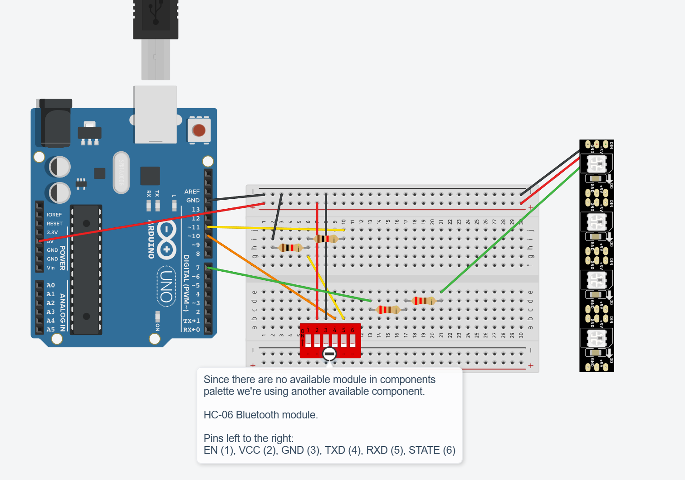
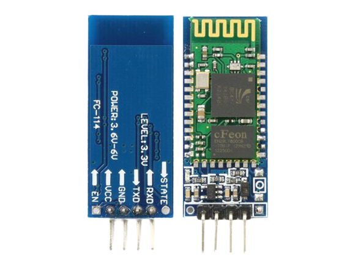
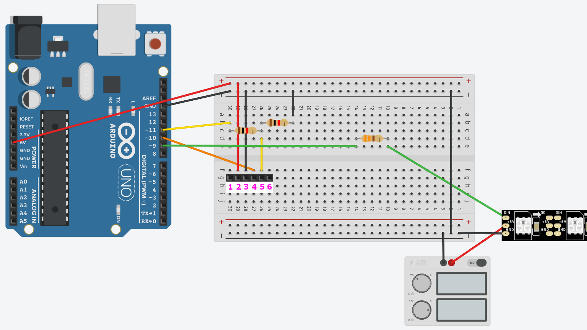
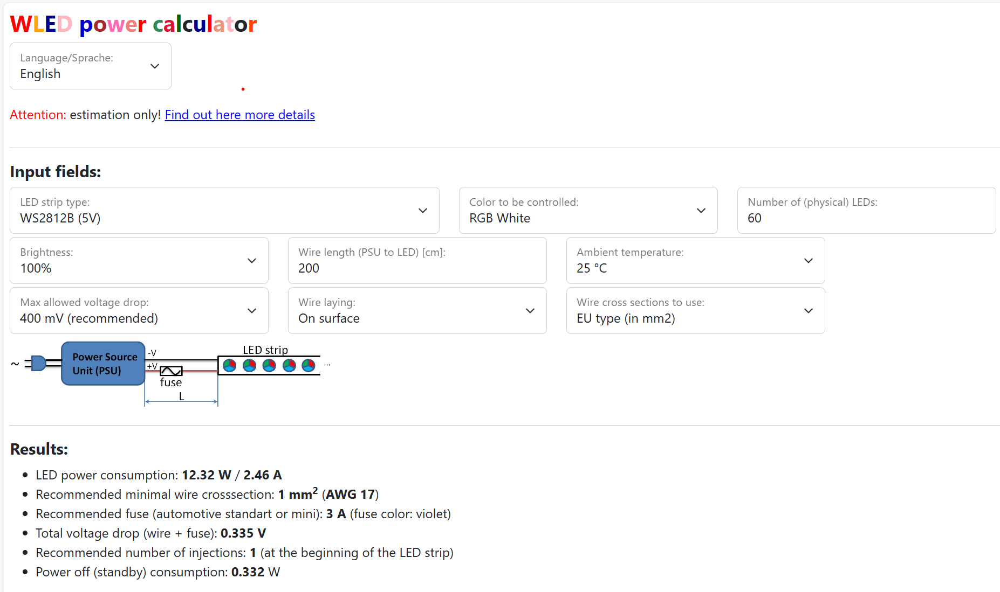
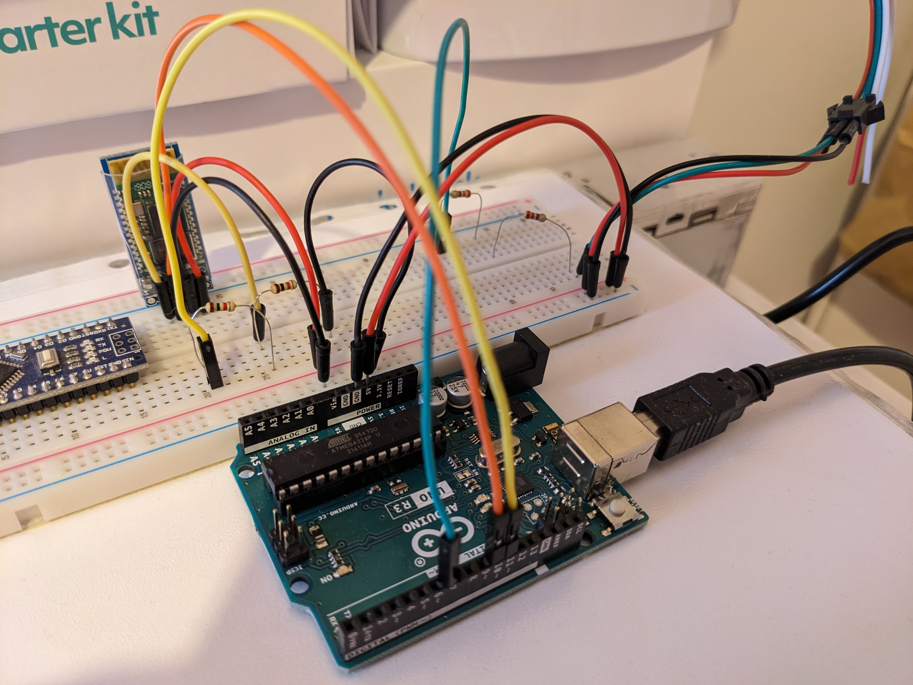
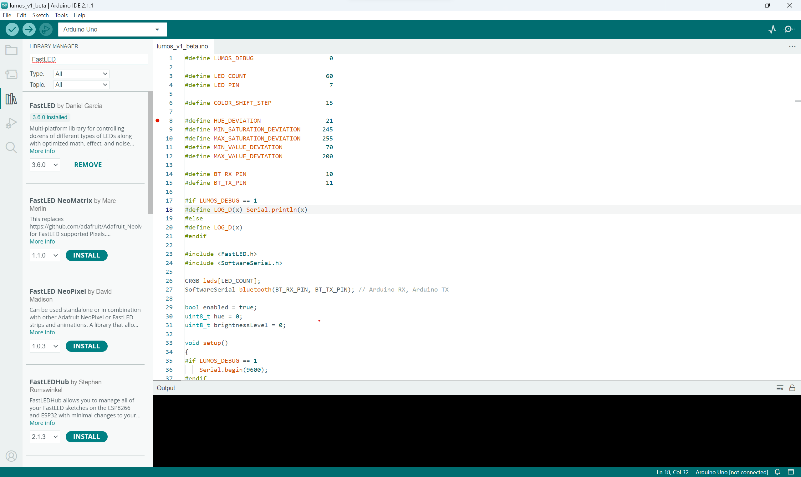
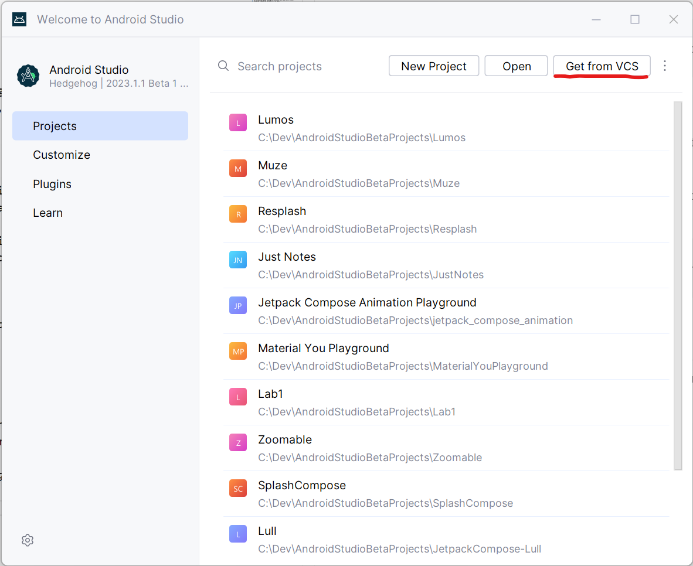
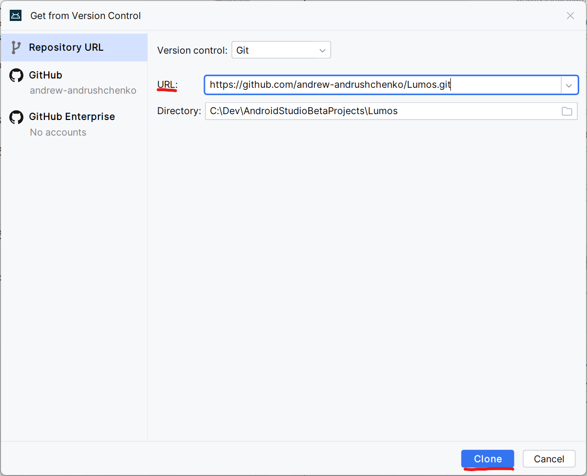
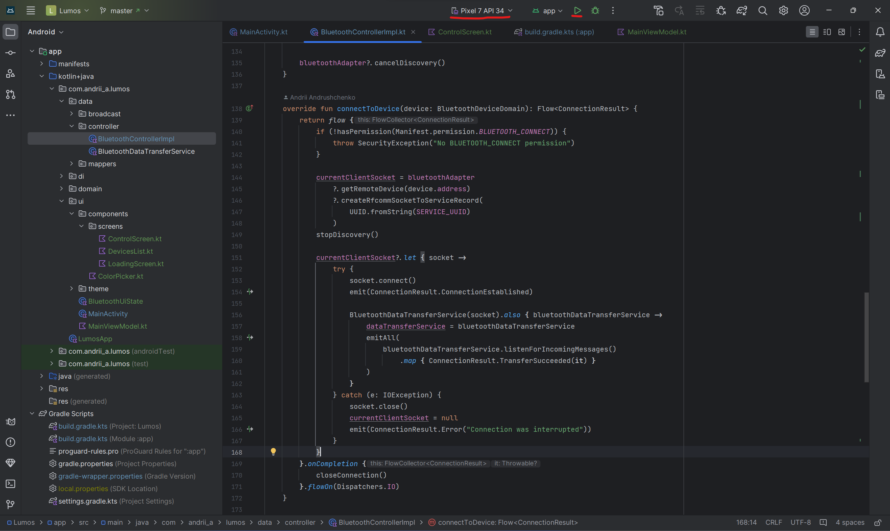

<figure class="gpi">
<link href="https://fonts.cdnfonts.com/css/major-mono-display-2" rel="stylesheet">

                
  <figcaption>luMOS:<br><span>Arduino led project</span></figcaption>
  <style>
    @import url('https://fonts.cdnfonts.com/css/major-mono-display-2');
    .gpi {
      font-family:  'Major Mono Display', sans-serif;                                   
      font-size: 40px;
      color: yellow;
    } 
    figcaption span {
      color: turquoise;
      font-size: 30px
    }
    .image{
      border-radius: 4%;
    }
  </style>
</figure>

---


## Table of Contents
- [Table of contents](#table-of-contents)
  - [What are we going to build?](#what-are-we-going-to-build)
  - [Prerequisites](#prerequisites)
  - [Hardware and Supplies](#hardware-and-supplies)
  - [Assembly](#assembly)
    - [Before you start](#before-you-start)
    - [Device assembly](#device-assembly)
      - [Simplified](#simplified)
      - [Advanced](#advanced)
    - [Post assembly device look](#post-assembly-device-look)
  - [Let the code do the work](#let-the-code-do-the-work)
    - [The basic idea](#the-basic-idea)
    - [Arduino part](#arduino-part)
    - [Android part](#android-part)
      - [Enable USB debugging](#enable-usb-debugging)
      - [Clone application from repository](#clone-application-from-repository)

## What are we going to build?
In this tutorial we are going to build a super beautiful unique room backlight which can replace home fireplace and can be controlled from your Android phone!

## Prerequisites
1. A PC or Mac with installed Windows, GNU/Linux or MacOS correspondingly.
1. An Android smartphone running Android 8.1.0 (API Level 27) or later.
1. Installed Arduino IDE version 2.1.1 or later.
1. Installed Git.
1. Installed and configured Android Studio and Android SDK.

> **Note** <br/>
> You can download Git from the [official git page](https://git-scm.com/download/win). <br/>
> [Click here](https://www.arduino.cc/en/software) to download the Arduino IDE.<br/>
> [Click here](https://developer.android.com/studio) to donwload the Android Studio.

## Hardware and Supplies
In order to assembly the device you need at least next hardware:
1. Arduino Nano/Uno/Leonardo with ATmega328P or ATmega32U4 microchip.
1. WS2812B addressable LED stripe (any type, length and LEDs count).
1. HC-06 UART bluetooth module.
1. Power supply on 5V and 3.2A or analogue.
1. Resistors on 1 kΩ ± 5% (2 pcs).
1. Resistors on 220 Ω ± 5% (2 pcs) or alternatively 1 pcs 330 Ω ± 5% resistor.
1. Breadboard.
1. Bunch of jumper wires.
1. Your desire and patience ;-)

## Assembly
### Before you start

Prepare your workspace to avoid losing parts or damaging the board with static shock or environmental variables. Arrange all components orderly, and inspect them for any potential damages that might cause delays later.
<p>
Heed any warnings and precautions: These can be found on the product's website or packaging. Devices may vary, so adapt to different situations accordingly.

### Device assembly

There are two possible device designes based on power scheme:
* Simplified (all components take power from the arduino pins);
* Advanced (only bluetooth take power from the arduino, LED stripe has its own).

#### Simplified



> **Note** <br/>
> Since there are no available module in components palette we're using some
> component with similar pinout (6 exactly) for HC-06 Bluetooth module. <br/>
>As you can see on the design the pins we're interested in are:<br/>
>```
> VCC(2), GND(3), TXD(4), RXD(5)
>```
> So we have regular UART interface module.<br/><br/>
> Actual HC-06 bluetooth module looks like this:<br/>


This design scheme is suitable for the LED stripes consisting of 30 or less LEDs. <br/>
The reason of that is in LEDs power consumption. One **WS2812B** LED consumes **0.06 A** at maximum brightness. And we can't power many stripe LEDs this way because it potentially may cause system instability or even damage. So assembly your device this way is only recommended for a small amount of LEDs.

#### Advanced



This design includes external power supply which can be added to the whole system as shown on the picture above.

The necessary power supply characteristics dependent on led stripe length and density (LEDs/m) can be calculated using [this page](https://wled-calculator.github.io/).<br/>

For our case (2 m LED stripe, 30 LEDs/m) we can get something like below:



<span style="color:red">**Important.**</span>
Be sure to connect both grounds together if you're using 2 different power sources. If you do not connect them, the voltage between these two grounds is somewhat random (determined by surrounding air, environment, etc.) and your signals might not be what you intended.

>**Note** <br/>
> * For a specified design of an electrical system, you must precisely meet the normative specifications applicable in your country! This calculator can only provide a first estimate!
> * Normative bases: VDE 0298 Teil 2 und 4, VDE 0100 Teil 430 (German technical rules)
> * Assumption: cable with PVC insulation; maximum operating temperature 70°C
> * Additionally some other simplifications and assumptions!
> * Fuse data: based on Littlefuse data sheets
> * Power injections: assumed max. current per end injection 4.5 A; 9 A for middle injection (mini strip: 3 A / 6 A)
> * LED power data: own measurement + approx. 10% margin
> * The number of LEDs to be entered is always the number of physical LEDs (even if groups of 3 or 6 physical LEDs by 12V/24V strips are controlled as a single LED)

### Post assembly device look


## Let the code do the work

### The basic idea

The idea of that whole project based on the Perlin noise.
<p>
This type of noise can be used to create a great variety of procedural textures. Synthetic textures using Perlin noise are often used in CGI to make computer-generated visual elements - such as object surfaces, fire, smoke, or clouds - appear more natural, by imitating the controlled random appearance of textures in nature. In our case we are going to simulate the fire behaviour and Perlin noise is the best match for that purpose.

First things first we are going to use **HSV (Hue Saturation Value)** color model. Then we should receive via bluetooth the **HUE** value of our desired color, then slightly modify it using perlin-generated value as well as **SATURATION** and **VALUE** and send resulted values to the LED stripe.

### Arduino part

Open Arduino IDE, go to the libraries section (left stripe) and install the latest version of the FastLED library to be able to drive the stripe.



Clone the project repository using git on your computer:
```sh
> git clone https://github.com/andrew-andrushchenko/Lumos.git
```

After that you can find arduino project file with ***.ino** extension, open it.

Look at the very beginning of the code. Here we have some important setup definitions.

Here we can enable or disable debug mode to see (or not see XD) obtained values and other communications. (Set it to 0 to disable debug messages and to 1 to enable them).

```arduino
#define LUMOS_DEBUG                     0
```

Then we have **LED_COUNT** parameter which determines how many leds our stripe have. Put your amount here. **LED_PIN** parameter tells us on which arduino pin we would like to drive our led stripe. Put the arduino pin number to which stripe's **DIN** pin is connected.

```arduino
#define LED_COUNT                      60
#define LED_PIN                         7
```

Since we're using two-dimensional Perlin noise we should move around generated values with some step size. You can put your's here. You can play with the values but the default 15 is optimal one.

```arduino
#define COLOR_SHIFT_STEP               15
```

The next bunch of settings defines how much color components like **Hue**, **Saturation** and **Value** will bend around some base value creating realistic fire effect.

```arduino
#define HUE_DEVIATION                  21
#define MIN_SATURATION_DEVIATION      245
#define MAX_SATURATION_DEVIATION      255
#define MIN_VALUE_DEVIATION            70
#define MAX_VALUE_DEVIATION           200
```

Here we have bluetooth data transfer pins to define. Look carefully how you connected your HC-06 module data lines (RXD, TXD) and provide the correct arduino pins. <br/>
For instance if you connect your HC-06 **RXD** pin to arduino's 10th pin, and **TXD** pin to arduino's 11th pin, then the setup will look like below:

```arduino
#define BT_RX_PIN                      10
#define BT_TX_PIN                      11
```

Then define some macro which will vary based on debug defines. If debug is enabled the *LOG_D(x)* will be replaced everywhere in the code to *Serial.println(x)* line where *x* is some value to output, else *LOG_D(x)* will be replaced with empty line.

```arduino
#if LUMOS_DEBUG == 1
#define LOG_D(x) Serial.println(x)
#else
#define LOG_D(x)
#endif
```

After including necessary libraries such as FastLED to be able to drive LED stripe and SoftwareSerial to be able to control HC-06 bluetooth module we should define some global variables to use in our project.<br/>

```arduino
#include <FastLED.h>
#include <SoftwareSerial.h>

CRGB leds[LED_COUNT];
SoftwareSerial bluetooth(BT_RX_PIN, BT_TX_PIN);

uint8_t hue = 0;
uint8_t brightnessLevel = 0;
```

The line below allows us to define LED stripe as an array of size **LED_COUNT** in our code:

```arduino
CRGB leds[LED_COUNT];
```

This line allows us to define HC-06 module as an object in our code:

```arduino
SoftwareSerial bluetooth(BT_RX_PIN, BT_TX_PIN);
```

Next two lines define variables for current color hue and led stripe brightness which we will receive via bluetooth and use for whole project.

```arduino
uint8_t hue = 0;
uint8_t brightnessLevel = 0;
```

Here inside the setup function we're going to initialize our led stripe with our stripe type (NEOPIXEL), driving pin (LED_PIN) and our array which we have already defined earlier. We also initialize bluetooth serial with the default HC-06 module baud rate of 9600.

> **Note**<br/>
> HC-06 default baud rate can be changed to whatever else you want by configuring this module using dedicated configuration pins and AT commands. [Click here](https://www.instructables.com/AT-command-mode-of-HC-05-Bluetooth-module/) for more details and instructions.

```arduino
void setup()
{
#if LUMOS_DEBUG == 1
    Serial.begin(9600);
#endif
    LOG_D("Listening for incoming data...");

    FastLED.addLeds<NEOPIXEL, LED_PIN>(leds, LED_COUNT);
    FastLED.setBrightness(brightnessLevel);

    bluetooth.begin(9600);
}
```

After that we have main loop function:

```arduino
void loop()
{
    stripeCycle();

    if (bluetooth.available())
    {
        String cmd = "";
        while (bluetooth.available())
        {
            cmd += (char) bluetooth.read();
            m_delay(30);
        }

        LOG_D("Obtained value: " + cmd);

        parseCommand(cmd);
    }
}
```

Here we're going to do a couple of things:
* Update led stripe
* Receive and parse incoming data

All the magic happens inside the *stripeCycle* function. We defined global variable *counter* which takes part in noise generation process. General purpose for this function is to get each *20 ns* some noise value, generate color for the particular LED, set this color for the the corresponding LED on the stripe and finally repeat the procedure for the rest of the LEDs.

```arduino
int counter = 0;
inline void stripeCycle()
{
    static uint32_t prevTime;

    // shift the party :)
    if (millis() - prevTime > 20)
    {
        prevTime = millis();

        for (int i = 0; i < LED_COUNT; i++)
        {
            leds[i] = getLEDColor((inoise8(i * COLOR_SHIFT_STEP, counter)));
        }

        counter += 20;
        FastLED.show();
    }
}
```

Then the *getLEDColor* function allows us to generate a color based on some 8 bit integer (generated noise value in our case). Here we get the base hue value which is defined in the global variable and modify it with the obtained noise value mapping it from range *[0, 255]*  to *[0, HUE_DEVIATION]* to get closely natural fire color change. But also to achieve the actual fire effect we should also calculate *saturation* and *value* parameters.

For the *saturation* parameter we have the next logic:
* Map our noise value from *[0, 255]* to *[MAX_SATURATION_DEVIATION, MIN_SATURATION_DEVIATION]* range.
* Constrain mapped value to the range of *[0, 255]*.

The same applies to the *value* parameter.

```arduino
inline CHSV getLEDColor(uint8_t val)
{
    return CHSV(
        hue + map(val, 0, 255, 0, HUE_DEVIATION),
        constrain(map(val, 0, 255, MAX_SATURATION_DEVIATION, MIN_SATURATION_DEVIATION), 0, 255),
        constrain(map(val, 0, 255, MIN_VALUE_DEVIATION, MAX_VALUE_DEVIATION), 0, 255)
    );
}
```

The second big part is to obtain and parse data coming through bluetooth channel. For this purpose we have *parseCommand* function which takes some command in form of string, decides what type of the command has come, parses data from it and assigns corresponding global variables defined above.


```arduino
inline void parseCommand(const String& cmd)
{
    if (cmd.charAt(0) == 'c')
    {
        hue = map(cmd.substring(1).toInt(), 0, 360, 0, 255);

        LOG_D(hue);
    }

    if (cmd.charAt(0) == 'b')
    {
        int brightness = cmd.substring(1).toInt();
        brightnessLevel = map(brightness, 0, 100, 0, 255);
        FastLED.setBrightness(brightnessLevel);

        LOG_D(brightnessLevel);
    }
}
```

Currently we can obtain and process 2 types of commands:
* Color hue
* Stripe brightness

We defined some simple data protocol our program can use to understand our intensions. Here we have some definitions.

To change hue parameter we should send it as next string:
```
c<hue_value>
```
where *hue_value* is some value between 0 and 360.

Example of a valid command to change hue:
```
c128
```

To change brightness we should send it as next string:
```
b<brightness_value>
```
where *brightness_value* is some value between 0 and 100 expressed in percentages.

Example of a valid command to change hue:
```
b80
```

> **Note** <br/>
> We should map our *hue* value from the range of *[0, 360]* to *[0, 255]* and the *brightness* value from the range of *[0, 100]* to *[0, 255]* to fulfill FastLED library contracts.

### Android part

In this tutorial, we will not cover programming for mobile platforms but give you some instructions how to get our mobile app build and run on your device.

First of all install the latest stable Android Studio on your PC or Mac along with Android SDK tools (should be prompted to install automatically on first Android Studio run).

> **Note**<br/>
Depending on your android device you should probably install some additional drivers to be able to use usb debugging.

#### Enable USB debugging

Go to Settings on your phone, then System or About, and tap 5 times on the *Build version*, enter your lockscreen PIN or Pattern. Now you're successfully enabled the developer options menu on your smartphone.

Open them and switch on *Enable USB debugging* option.

#### Clone application from repository

Open Android Studio and select *Get from VCS* as on the screen below:



Then enter the next url into *URL* field:

```
https://github.com/andrew-andrushchenko/Lumos.git
```



and then press **Clone**.

Wait for the project to finish building.

Then connect your device to the computer grant all permissions (if needed), select your device from the devices list as you can see on the screen below and hit play (Shift + F10).



And you're good to go!

For the additional details see the project's [github page](https://github.com/andrew-andrushchenko/Lumos).
