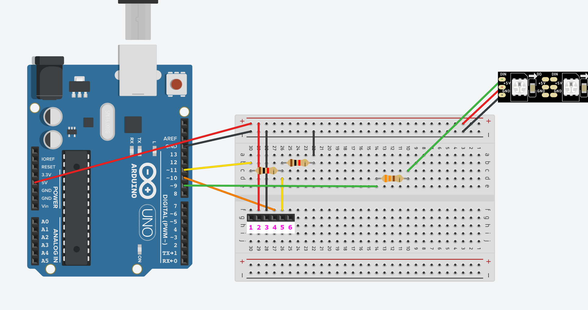

<figure class="gpi">
<link href="https://fonts.cdnfonts.com/css/major-mono-display-2" rel="stylesheet">

                
  <figcaption>luMOS:<br><span>Arduino room ambient light project</span></figcaption>
  <style>
    @import url('https://fonts.cdnfonts.com/css/major-mono-display-2');
    .gpi {
      font-family:  'Major Mono Display', sans-serif;                                   
      font-size: 40px;
      color: yellow;
    } 
    figcaption span {
      color: turquoise;
      font-size: 30px
    }
    .image {
      border-radius: 2vmin;
    }
    table {
      background-color: none !important;
    }
    td, th, tr {
      border: none !important;
      background: transparent !important;
    }
  </style>
</figure>

---
| <!-- --> | <!-- --> |
|----------|----------|
|  |  |
|  |  |

## Table of Contents
- [What are we going to build?](#what-are-we-going-to-build)
- [Prerequisites](#prerequisites)
- [Get things together](#get-things-together)
  - [Hardware and Supplies](#hardware-and-supplies)
  - [Before you start](#before-you-start)
  - [Device assembly](#device-assembly)
    - [With no external power supply](#with-no-external-power-supply)
    - [With an external power supply](#with-an-external-power-supply)
  - [Post-assembly device look](#post-assembly-device-look)
- [Let the code do the work](#let-the-code-do-the-work)
  - [The basic idea](#the-basic-idea)
  - [Arduino part](#arduino-part)
    - [Basic code setup parameters](#basic-code-setup-parameters)
    - [Some code explanations](#some-code-explanations)
  - [Android part](#android-part)
    - [Manual build and install](#manual-build-and-install)
    - [Install precompiled APK](#install-precompiled-apk)
- [Future plans](#future-plans)

## What are we going to build?
In this tutorial, we are going to build a unique and beautiful DIY Bluetooth-controlled room ambient light based on the WS2812B addressable LED stripe and the HC-06 UART Bluetooth module.

## Prerequisites
1. A PC or Mac with installed Windows, GNU/Linux, or macOS correspondingly.
1. An Android smartphone running Android 8.1.0 (API Level 27) or later.
1. Installed Arduino IDE version 2.1.1 or later.
1. Installed Git.
1. Installed and configured Android Studio and the Android SDK.

> **Note** <br/>
 Download links for the necessary tools: <br/>
> - [Git](https://git-scm.com/download/win) official page.<br/>
> - [Arduino IDE](https://www.arduino.cc/en/software) official page.<br/>
> - [Android Studio](https://developer.android.com/studio) official page.

## Get things together

### Hardware and Supplies
In order to assembly the device you need at least next hardware:
1. Arduino Nano, Uno or Leonardo with an ATmega328P or ATmega32U4 microcontroller.
1. WS2812B addressable LED stripe (any type, length, and LED count).
1. HC-06 UART Bluetooth module.
1. Power supply on 5V and 3.2A or analog.
1. Resistors of 1 kΩ ± 5% (2 pcs).
1. Resistors of 220 Ω ± 5% (2 pcs) or alternatively, 1 pcs 330 Ω ± 5% resistor.
1. Breadboard.
1. A bunch of jumper wires.
1. Your desire and patience ;-)

### Before you start

Prepare your workspace to avoid losing parts or damaging the board with static shock or environmental variables. Arrange all components in an orderly manner and inspect them for any potential damages that might cause delays later.

Heed any warnings and precautions. These can be found on the product's website or packaging. Devices may vary, so adapt to different situations accordingly.

### Device assembly

There are two possible device designs based on the power scheme:
* With no external power supply (all components take power from the arduino);
* With an external power supply (only Bluetooth takes power from the Arduino, LED stripe has its own).

#### With no external power supply



?> Since there are no available Bluetooth modules in the [Tinkercad](https://www.tinkercad.com/) component palette, it was replaced with a 6-pin substitute component. <br/><br/>
Pins we are interested in:<br/>
VCC(2), GND(3), TXD(4), RXD(5)<br/><br/>
And here is what the actual HC-06 Bluetooth module looks like:<br/>


This design scheme is suitable for LED stripes consisting of 30 or fewer LEDs.
The reason for that is power consumption. One **WS2812B** LED consumes approximately **0.06 A** at maximum brightness. And we can't power many stripe LEDs this way because it could potentially cause system instability or even damage. So, assembling your device this way is only recommended for a few LEDs (up to 30).

#### With an external power supply


This design includes external power supply which can be added to the whole system as shown on the picture above.

The necessary power supply characteristics, dependent on LED stripe length and density (LEDs/m), can be calculated using [this page](https://wled-calculator.github.io/).<br/>

In my case (2 m LED stripe, 30 LEDs/m), we can get something like below:


!>Be sure to connect both grounds together if you're using two different power sources. If you do not connect them, the voltage between these two grounds is somewhat random (determined by the surrounding air, environment, etc.), and your signals might not be what you intended.

>**Note** <br/>
> * For a specified design of an electrical system, you must precisely meet the normative specifications applicable in your country! This calculator can only provide a first estimate!
> * Normative bases: VDE 0298 Teil 2 und 4, VDE 0100 Teil 430 (German technical rules)
> * Assumption: cable with PVC insulation; maximum operating temperature 70°C
> * Additionally some other simplifications and assumptions!
> * Fuse data: based on Littlefuse data sheets
> * Power injections: assumed max. current per end injection 4.5 A; 9 A for middle injection (mini strip: 3 A / 6 A)
> * LED power data: own measurement + approx. 10% margin
> * The number of LEDs to be entered is always the number of physical LEDs (even if groups of 3 or 6 physical LEDs by 12V/24V strips are controlled as a single LED)

### Post-assembly device look


## Let the code do the work

### The basic idea

The main idea of this project is based on Perlin noise.

This type of noise can be used to create a great variety of procedural textures. Synthetic textures using Perlin noise are often used to make computer-generated visual elements, such as object surfaces, fire, smoke, or clouds, appear more natural by imitating the controlled random appearance of textures in nature. In our case, we are going to simulate fire behavior, and Perlin noise is the best match for that purpose.

For this project, we are going to use the **HSV (Hue Saturation Value)** color model. Then, using the Bluetooth module, we should receive the **Hue** of our desired color, slightly modify it using the generated value as well as **Saturation** and **Value** parameters, and send the resulted values to the LED stripe.

### Arduino part

Clone the project repository using git on your computer:
```sh
$ git clone https://github.com/andrew-andrushchenko/Lumos-arduino.git
```

After that, you can find an Arduino project file with ***.ino** extension. Open it.

?> To be able to compile and use this sketch, you should install the latest version of the [FastLED](https://github.com/FastLED/FastLED) Arduino library.


#### Basic code setup parameters
Look at the very beginning of the code. Here are some important setup definitions:

This line allows us to enable or disable debug mode to see (or not see XD) data transfer communications. (Set it to 1 to enable and 0 to disable.)

```clike
#define LUMOS_DEBUG  0
```

Then we have the **LED_COUNT** parameter, which defines how many LEDs our stripe has. Put your amount here. The **LED_PIN** parameter points to an arduino pin that will send commands to the LED stripe. This pin is wired to the stripe's **DIN**.

```clike
#define LED_COUNT  60
#define LED_PIN     7
```

Since we are using two-dimensional Perlin noise, we should move around the generated values with some step size. You can put yours here. You can play with the values, but the default 15 is an optimal one.

```clike
#define COLOR_SHIFT_STEP  15
```

The next bunch of settings defines how much components like **Hue**, **Saturation** and **Value** should bend around some base value, creating a realistic fire effect.

```clike
#define HUE_DEVIATION                  21
#define MIN_SATURATION_DEVIATION      245
#define MAX_SATURATION_DEVIATION      255
#define MIN_VALUE_DEVIATION            70
#define MAX_VALUE_DEVIATION           200
```

Here we have Bluetooth data transfer pins to define. Look carefully at how you connected your HC-06 module data lines (RXD and TXD) and provide the correct Arduino pins. <br/>
For instance, if you connect your HC-06 **RXD** pin to the Arduino's 10th pin and your **TXD** pin to the Arduino's 11th pin, then the setup will look like this:

```clike
#define BT_RX_PIN                      10
#define BT_TX_PIN                      11
```

Then we define some macros, which will vary based on the debug definition. If debug is enabled, the *LOG_D(x)* will be replaced by the *Serial.println(x)* line everywhere in the code where *x* is some value to output; otherwise, *LOG_D(x)* will be replaced with nothing.

```clike
#if LUMOS_DEBUG == 1
#define LOG_D(x) Serial.println(x)
#else
#define LOG_D(x)
#endif
```

At this point, we have finished our basic setup.

#### Some code explanations

After including necessary libraries such as Fast LED to be able to drive LED strips and Software Serial to be able to control the HC-06 Bluetooth module, we should define some global variables to use in our project.<br/>

```clike
#include <FastLED.h>
#include <SoftwareSerial.h>

CRGB leds[LED_COUNT];
SoftwareSerial bluetooth(BT_RX_PIN, BT_TX_PIN);

uint8_t hue = 0;
uint8_t brightnessLevel = 0;
```

The line below allows us to define the LED stripe as an array of size **LED_COUNT** in our code.

```clike
CRGB leds[LED_COUNT];
```

This line allows us to define the HC-06 module as an object in our code.

```clike
SoftwareSerial bluetooth(BT_RX_PIN, BT_TX_PIN);
```

The next two lines introduce variables for current color hue and LED stripe brightness, which we will receive via Bluetooth.

```clike
uint8_t hue = 0;
uint8_t brightnessLevel = 0;
```

Here inside the setup function, we're going to initialize our LED stripe with our stripe type (NEOPIXEL), driving pin (LED_PIN) and array, which we have already defined earlier. We also initialize Bluetooth serial with the default HC-06 module baud rate of 9600.

?> HC-06 default baud rate can be changed to whatever else you want by configuring this module using dedicated configuration pins and AT commands. [Click here](https://www.instructables.com/AT-command-mode-of-HC-05-Bluetooth-module/) for more details and instructions.

```clike
void setup()
{
#if LUMOS_DEBUG == 1
    Serial.begin(9600);
#endif
    LOG_D("Listening for incoming data...");

    FastLED.addLeds<NEOPIXEL, LED_PIN>(leds, LED_COUNT);
    FastLED.setBrightness(brightnessLevel);

    bluetooth.begin(9600);
}
```

After that, we have the main loop function:

```clike
void loop()
{
    stripeCycle();

    if (bluetooth.available())
    {
        String cmd = "";
        while (bluetooth.available())
        {
            cmd += (char) bluetooth.read();
            m_delay(30);
        }

        LOG_D("Obtained value: " + cmd);

        parseCommand(cmd);
    }
}
```

Here, we are going to do a couple of things:
* Update LED stripe
* Receive and parse incoming data.

All the magic happens inside the *stripeCycle* function. We introduced the global variable *counter*, which takes part in the noise generation process. The general purpose of this function is to get for each *20 ms* some noise value, generate color for the particular LED, set this color to the corresponding LED on the stripe, and finally repeat the procedure for the rest of the LEDs.

```clike
int counter = 0;
inline void stripeCycle()
{
    for (int i = 0; i < LED_COUNT; i++)
    {
        leds[i] = getLEDColor((inoise8(i * COLOR_SHIFT_STEP, counter)));
    }

    counter += 20;
    FastLED.show();

    m_delay(20);
}
```

Then, the *getLEDColor* function allows us to generate a color based on some 8-bit integer (the generated noise value in our case). Here we get the base hue value, which is defined in the global variable, and modify it with the obtained noise value, mapping it from the range *[0, 255]*  to *[0, HUE_DEVIATION]* to get a closely natural fire color change. But to achieve the actual fire effect, we should also calculate *saturation* and *value* parameters.

For the *saturation* parameter, we have the next logic:
* Map our noise value from *[0, 255]* to the *[MAX_SATURATION_DEVIATION, MIN_SATURATION_DEVIATION]* range.
* Constrain the mapped value to the range of *[0, 255]*.

The same applies to the *value* parameter.

```clike
inline CHSV getLEDColor(uint8_t val)
{
    return CHSV(
        hue + map(val, 0, 255, 0, HUE_DEVIATION),
        constrain(map(val, 0, 255, MAX_SATURATION_DEVIATION, MIN_SATURATION_DEVIATION), 0, 255),
        constrain(map(val, 0, 255, MIN_VALUE_DEVIATION, MAX_VALUE_DEVIATION), 0, 255)
    );
}
```

The second big part is to obtain and parse the data coming through the Bluetooth channel. For this purpose, we have the *parseCommand* function, which takes some command in the form of a string, decides what type of command has come, parses data from it, and assigns corresponding global variables defined above.


```clike
inline void parseCommand(const String& cmd)
{
    if (cmd.charAt(0) == 'c')
    {
        hue = map(cmd.substring(1).toInt(), 0, 360, 0, 255);

        LOG_D(hue);
    }

    if (cmd.charAt(0) == 'b')
    {
        int brightness = cmd.substring(1).toInt();
        brightnessLevel = map(brightness, 0, 100, 0, 255);
        FastLED.setBrightness(brightnessLevel);

        LOG_D(brightnessLevel);
    }
}
```

Currently, the program can react to these types of incoming commands:
* Change color hue
* Change stripe brightness

To change the hue parameter, we should send it as a next string:
```
c<hue_value>
```
where *hue_value* is some value between 0 and 360.

Example of a valid command to change hue:
```
c128
```

To change brightness, we should send it as a next string:
```
b<brightness_value>
```
where *brightness_value* is some value between 0 and 100 expressed in percentages.

Example of a valid command to change brightness:
```
b80
```

?> We should map our hue value from the range of *[0, 360]* to *[0, 255]* and our brightness value from the range of *[0, 100]* to *[0, 255]* to fulfill FastLED library contracts.

### Android part

In this tutorial, we will not cover programming for mobile platforms but give you some instructions how to get our mobile app built and running on your device.

Firstly, install the latest stable version of Android Studio on your PC or Mac along with the Android SDK tools (you should be prompted to install them automatically on the first Android Studio run).

#### Manual build and install

?> Depending on your Android device, you should probably install some additional drivers to be able to use USB debugging.

**Enable USB debugging**

Go to Settings on your phone, then System or About, and tap five times on the *Build version*. Enter your lockscreen PIN or pattern. Now, you have successfully enabled the developer options menu on your smartphone.

Open them and switch on the "Enable USB debugging" option.

**Clone application from repository**

Open Android Studio and select "Get from VCS" as shown on the screen below:


Then enter the next URL into the *URL* field:

```
https://github.com/andrew-andrushchenko/Lumos.git
```


and then press **Clone**.

Wait for the project to finish building.

Then connect your device to the computer, grant all permissions (if needed), select your device from the device list as you can see on the screen below, and hit play (Shift + F10) or debug (Shift + F9).


And you are good to go!

#### Install precompiled APK

Go to the project's [GitHub](https://github.com/andrew-andrushchenko/Lumos) page, find the releases section, and download the compiled APK file. Install it on your phone, and you are good to go!

!> In order to install this app, you should grant permission to install apps from unknown sources.

For additional details, see the project's [GitHub page](https://github.com/andrew-andrushchenko/Lumos).

## Future plans

* Make an iOS version of the application
* Add more backlight modes (rainbow, color wheel, etc.)
* Publish the application on the Google Play Store and Apple Store.