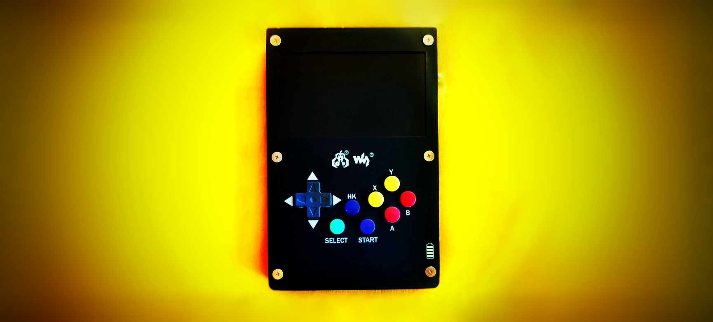
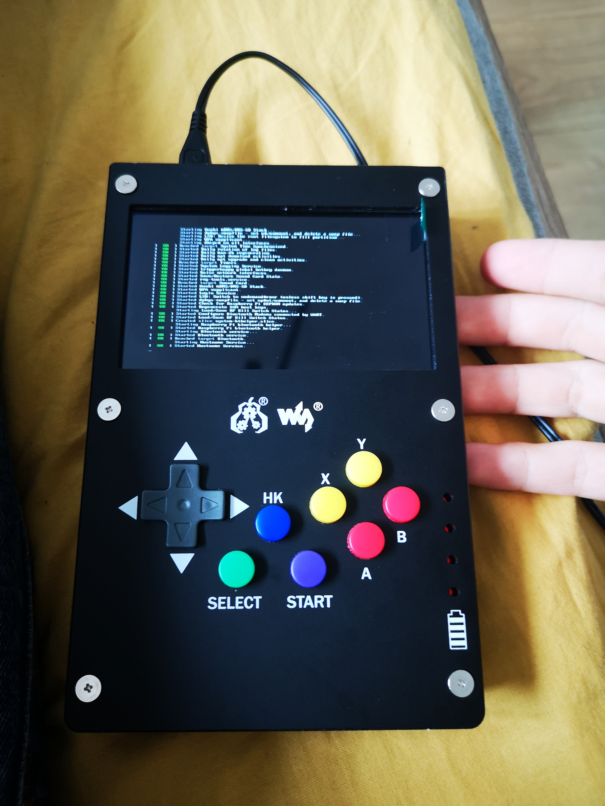
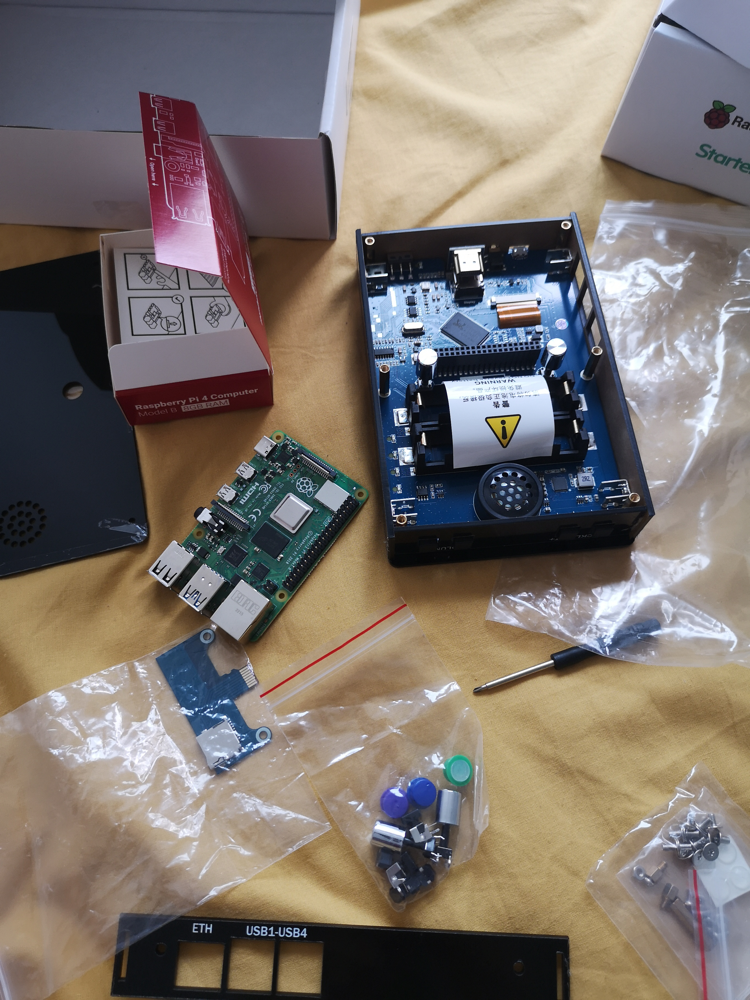
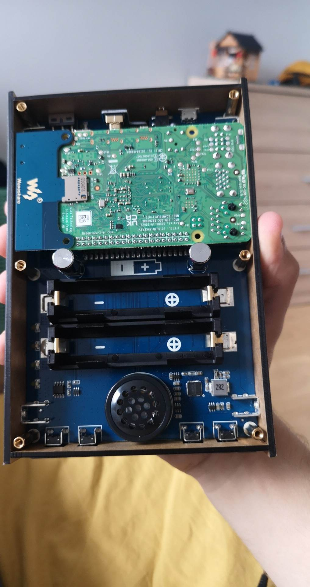
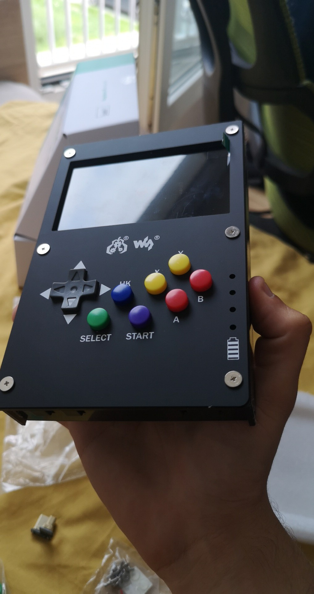
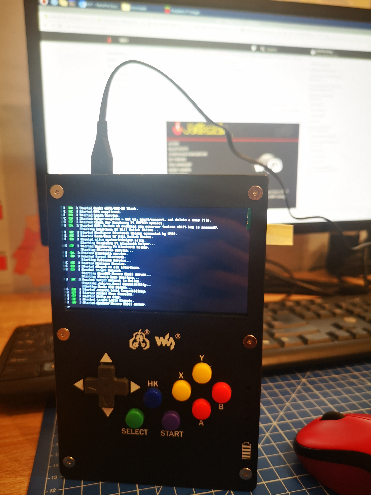
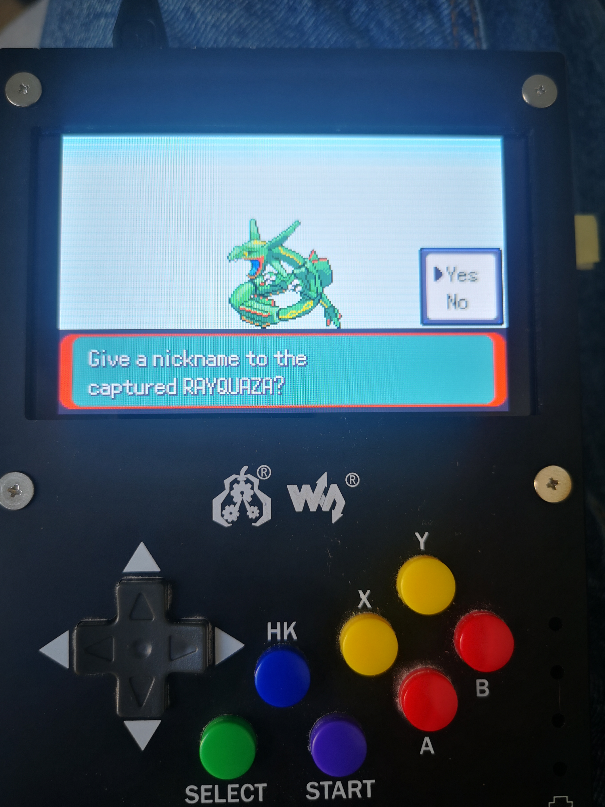
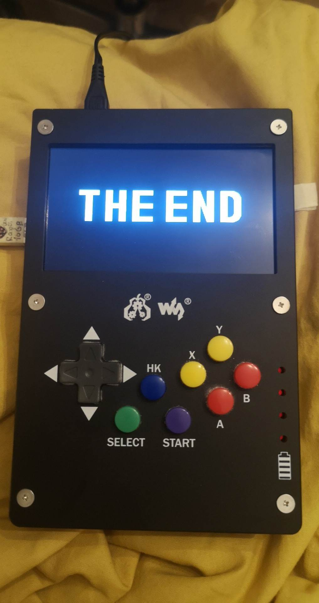

[ENG](gamepi43/gamepi43.md) | [PL](PL/gamepi43/gamepi43.md)

<figure class="gpi">
<link href="https://fonts.cdnfonts.com/css/major-mono-display-2" rel="stylesheet">
                
  <figcaption>GamePi43:<br><span>Konsola do gier Raspberry Pi</span></figcaption>
  <style>
    @import url('https://fonts.cdnfonts.com/css/major-mono-display-2');
    .gpi {
      font-family:  'Major Mono Display', sans-serif;                                   
      font-size: 35px;
      color: yellow;
    } 
    figcaption span {
      color: turquoise;
      font-size: 30px
    }
    .image-border {
      margin: 40px;
      /* border-radius: 1vmin; */
      border: 3px solid var(--primary);
      box-shadow:
        10px 10px 0 -3px var(--background),
        10px 10px var(--green),
        20px 20px 0 -3px var(--background),
        20px 20px var(--yellow);
    }
    .image-border:hover {
      animation: shadow-wave 2.5s ease-in infinite;
    }
    @keyframes shadow-wave {
      0% {
        border: 3px solid var(--primary);
        box-shadow: 10px 10px 0 -3px var(--background), 10px 10px var(--green),
          20px 20px 0 -3px var(--background), 20px 20px var(--yellow);
      }
      20% {
        border: 3px solid var(--red);
        box-shadow: 10px 10px 0 -3px var(--background), 10px 10px var(--primary),
          20px 20px 0 -3px var(--background), 20px 20px var(--green);
      }
      40% {
        border: 3px solid var(--orange);
        box-shadow: 10px 10px 0 -3px var(--background), 10px 10px var(--red),
          20px 20px 0 -3px var(--background), 20px 20px var(--primary);
      }
      60% {
        border: 3px solid var(--yellow);
        box-shadow: 10px 10px 0 -3px var(--background), 10px 10px var(--orange),
          20px 20px 0 -3px var(--background), 20px 20px var(--red);
      }
      80% {
        border: 3px solid var(--green);
        box-shadow: 10px 10px 0 -3px var(--background), 10px 10px var(--yellow),
          20px 20px 0 -3px var(--background), 20px 20px var(--orange);
      }
      100% {
        border: 3px solid var(--primary);
        box-shadow: 10px 10px 0 -3px var(--background), 10px 10px var(--green),
          20px 20px 0 -3px var(--background), 20px 20px var(--yellow);
      }
    }
    :root {
      --primary: #22D2A0;
      --secondary: #192824;
      --background: #192824;
      --green: #1FC11B;
      --yellow: #FFD913;
      --orange: #FF9C55;
      --red: #FF5555;
    }
    @media only screen and (max-width: 600px) {
      .image-border {
        margin-left: 0;
        margin-right: 50px;
      }
    }
  </style>
</figure>

---


## Spis treści

- [Spis treści](#spis-treści)
- [Wstęp](#wstęp)
- [Urządzenia i zaopatrzenie](#urządzenia-i-zaopatrzenie)
- [Proces montażu](#proces-montażu)
  - [Przed montażem](#przed-montażem)
  - [Montaż urządzenia](#montaż-urządzenia)
- [System operacyjny](#system-operacyjny)
  - [Łatwy sposób](#łatwy-sposób)
  - [Nieco trudniejszy sposób](#nieco-trudniejszy-sposób)
- [Gry ROM](#gry-rom)
  - [Użycie pendrive'a (lub innego odpowiedniego nośnika)](#użycie-pendrivea-lub-innego-odpowiedniego-nośnika)
  - [Bezprzewodowo za pomocą SFTP (bardziej zaawansowana metoda)](#bezprzewodowo-za-pomocą-sftp-bardziej-zaawansowana-metoda)
- [Gry Pico-8](#gry-pico-8)
- [Dostosowywanie](#dostosowywanie)
  - [Domyślne motywy](#domyślne-motywy)
  - [Motywy niestandardowe](#motywy-niestandardowe)
  - [Dopasuj zawartość do ekranu](#dopasuj-zawartość-do-ekranu)
  - [Niestandardowy obraz uruchamiania](#niestandardowy-obraz-uruchamiania)
  - [Niestandardowe wideo uruchamiania](#niestandardowe-wideo-uruchamiania)
  - [Usuwanie tekstu uruchamiania](#usuwanie-tekstu-uruchamiania)
  - [Scrapowanie gier](#scrapowanie-gier)
- [Najlepsze praktyki](#najlepsze-praktyki)
- [Podsumowanie](#podsumowanie)

---



## Wstęp

GamePi43 to konsola do gier o retro-stylu, która wykorzystuje Raspberry Pi jako główny komponent.

Jej odtworzenie jest dość proste i wymaga umiejętności na poziomie od niskiego do średniozaawansowanego, jeśli chodzi o podstawową konfigurację, oraz na poziomie średniozaawansowanym, jeśli chodzi o dostosowywanie.

To świetny projekt do podjęcia i niesamowite urządzenie do gry.

Chociaż obudowa konsoli nie jest ergonomiczna, a przyciski trudne do naciśnięcia, spełnia

 ona swoje zadanie. Pomimo niższej jakości inżynieryjnej niż konsole zaprojektowane wyłącznie do grania, jej wszechstronność i dostosowywanie czynią ją wartościowym projektem, pomimo tych wad.

Zacznijmy od tego, czego potrzebujemy, aby konsola działała:

## Urządzenia i zaopatrzenie

Budowa konsoli GamePi43 jest stosunkowo prosta. Wymagane komponenty to zgodny model Raspberry Pi (np. B+ / 2B / 3B / 3B+ / 4B). Pamiętaj, aby sprawdzić zgodność z urządzeniem [GamePi43](https://www.waveshare.com/wiki/GamePi43).

W mojej budowie użyłem [kompletnego zestawu Raspberry Pi 4 8GB Kit od Botland](#) oraz [GamePi43 od Botland](https://botland.com.pl/gaming-pi-retro-pie-konsole/17598-gamepi43-zestaw-akcesoriow-do-budowy-konsoli-dla-raspberry-pi-b-2b-3b-3b-4b-waveshare-16967-5904422327965.html?cd=1050025856&ad=55008030609&kd=&gclid=Cj0KCQjwuZGnBhD1ARIsACxbAVi_yP_z9whvMxNqS_-G67z5Up9icvYHbGoLaR1e1NCGWmEW12LuSBYaAiQnEALw_wcB).

?>**_Uwaga:_**  
Do tego konkretnego projektu potrzebny jest tylko Raspberry Pi. Kompletny zestaw zakupiłem tylko dlatego, że był częścią innych projektów. Jeśli skupiasz się wyłącznie na konsoli GamePi43, zakupienie tylko Raspberry Pi to ekonomiczna opcja.

GamePi43 zawiera śrubokręt, ale zalecam mieć własny oraz mikrofibrę do czyszczenia odcisków palców z ekranu.

!>**_Bądź świadomy:_**   
W zestawie, którym się posłużyłem, nie było baterii. Konsola działa z ładowarką podłączoną bezpośrednio do źródła zasilania za pomocą kabla. Jeśli chcesz mieć bezprzewodową konsolę z akumulatorem do ładowania, musisz kupić akumulatory i umieścić je w miejscu, które znajduje się już w obudowie GamePi.

Może być także konieczne użycie czystego pendrive'a USB, w zależności od przeznaczenia konsoli.

## Proces montażu



### Przed montażem

Przygotuj miejsce pracy, aby uniknąć utraty części lub uszkodzenia płyty głównej z powodu wyładowań elektrostatycznych lub zmiennych warunków środowiskowych. Uporządkuj wszystkie komponenty w porządku, a następnie sprawdź je pod kątem potencjalnych uszkodzeń, które mogą spowodować opóźnienia w dalszym procesie.

!>**_Zwracaj uwagę na ostrzeżenia i środki ostrożności:_**   
Mogą się one znajdować na stronie produktu lub na opakowaniu. Urządzenia mogą się różnić, więc dostosuj się do różnych sytuacji. Sprawdź zgodność z wyprzedzeniem.

### Montaż urządzenia

Montaż jest dość prosty, jeśli masz wszystkie niezbędne części. Postępuj zgodnie z instrukcjami dołączonymi do GamePi43 lub skonsultuj się z witryną producenta, aby uzyskać bardziej szczegółowy opis.



Uważam, że [ten wizualny samouczek na YouTube](https://www.youtube.com/watch?v=HrKpUuo6OUg&t=173s) autorstwa MakerMana okazał się pomocny.

Podczas montażu nie napotkałem na żadne istotne problemy. Włożenie adaptera HDMI było nieco trudniejsze, ale udało się. Jeśli masz przygotowaną kartę SD z wymaganym systemem i grami, włóż ją, podłącz zasilanie, i gotowe! Jeśli nie, poniżej znajdziesz dalsze instrukcje dotyczące instalacji [systemu operacyjnego](#system-operacyjny) i [gier](#gry-pico-8).



## System operacyjny

Po przygotowaniu fizycznego urządzenia, następnym krokiem jest zainstalowanie systemu operacyjnego. Na szczęście Waveshare dostarcza gotowy system operacyjny. Poniżej znajdziesz zarówno [łatwą metodę](#łatwy-sposób), jak i [zaawansowaną metodę](#nieco-trudniejszy-sposób).



### Łatwy sposób

Użyj dostosowanej wersji systemu operacyjnego RetroPie/Recalbox od Waveshare, skonfigurowanej z dodatkowymi ustawieniami i modyfikacjami znalezionymi [tutaj](https://www.waveshare.com/wiki/GamePi43).

Użyj aplikacji do tworzenia obrazu, takiej jak [Raspberry Pi Imager](https://www.raspberrypi.com/software/), aby zapisać system operacyjny na karcie SD. Włóż ją do urządzenia, uruchom je i skonfiguruj ustawienia, takie jak strefa czasowa, WiFi itp.

Jeśli wszystko przebiegnie pomyślnie, pozostanie ci tylko zainstalować wybrane gry, czy to [gry ROM](#gry-rom), czy [gry Pico-8](#gry-pico-8).

### Nieco trudniejszy sposób


Zainstaluj aplikację do tworzenia obrazów (ja użyłem Raspberry Imager).

Na czystej karcie SD (lub innych odpowiednich nośnikach) zapisz najnowszy system operacyjny Retropie/RecallBox odpowiedni dla twojego urządzenia.

Wprowadź podstawowe informacje, takie jak strefa czasowa i WiFi, przed lub po zapisaniu obrazu.

Włóż kartę SD do obudowy Gamepi i uruchom urządzenie.

Dokładnie skonfiguruj to, co pozostało - głównie przyciski wejściowe.

Dostosuj urządzenie w ustawieniach lub w terminalu, używając klawisza `F4` i podłączając klawiaturę.

I to wszystko, ten krok jest trudniejszy głównie dlatego, że musisz skonfigurować każdą część systemu operacyjnego ręcznie, ale da się to zrobić.

## Gry ROM

Instalacja gier ROM jest niezwykle prosta. Poniżej przedstawione są dwie podstawowe metody.



### Użycie pendrive'a (lub innego odpowiedniego nośnika)

Przygotuj pendrive o pojemności co najmniej 8 GB (zalecane). Wyczyść go i sformatuj na FAT32.

Wewnątrz utwórz pusty katalog o nazwie `retropie` (zależnie od używanego systemu operacyjnego ta nazwa może się różnić; ta działała dla mnie, ale możesz także spróbować `retropie-mount` lub innych, jeśli żadne z nich nie działa).

Następnie zaktualizuj urządzenie (pomiń ten krok, jeśli korzystasz już z najnowszej wersji systemu operacyjnego):

```
Ekran główny > RetroPie > RetroPie Setup > Podstawowa instalacja
```

Włącz usługę ROM na pendrive'ie:

```
Ekran główny > RetroPie > RetroPie Setup > Konfiguracja / narzędzia > usbromservice - Usługa ROM na USB > 1 Włącz usługę ROM na USB
```

Podłącz pendrive USB do działającego urządzenia GamePi43 i pozostaw go. Ten krok jest trudny, ponieważ nie ma żadnych wskaźników ukończenia procesu, chyba że pendrive USB ma diodę sygnalizującą transfer danych. Pozostaw go na 5-15 minut, a następnie zrestartuj urządzenie i podłącz pendrive USB z powrotem do komputera.

Jeśli wszystko poszło dobrze, w pendrive'ie USB powinny pojawić się nowe katalogi robocze. (Sam miałem tu trochę problemów, ponieważ z jakiegoś powodu mój pendrive nie był kompatybilny z systemem Retropie OS, ale po pewnym czasie udało mi się go naprawić, gdy przetestowałem inny dostępny pendrive USB, który działał dobrze).

Teraz musisz znaleźć gry - to od ciebie zależy, jaką grę chcesz użyć. W ramach tego samouczka potrzebujemy tylko pliku ROM gry, to wszystko.

Znajdź odpowiedni katalog konsoli w katalogach na pendrive'ie USB i skopiuj plik gry do tego katalogu.

Zrestartuj urządzenie, i to wszystko! Jesteś teraz gotów, aby grać na swojej nowej wspaniałej konsoli!

Polecam [ten samouczek wideo na YouTube](https://www.youtube.com/watch?v=P1etPYvWBZU&t=373s) stworzony przez ETA PRIME, jeśli napotkasz jakieś problemy.

### Bezprzewodowo za pomocą SFTP (bardziej zaawansowana metoda)

Dla bardziej zaawansowanej metody transferu gier użytkownik może skorzystać z SFTP (SSH File Transfer Protocol).

Po pierwsze - włącz SSH na GamePi34:

```
raspi-config > Opcje interfejsu > SSH > Tak > OK > Zakończ
```

Znajdź adres IP urządzenia:

```
RetroPie > Pokaż IP
```

Korzystając z klienta SFTP (np. FileZilla) na swoim urządzeniu z plikami gier ROM, połącz się z GamePi, używając jego adresu IP i danych logowania.

W większości przypadków konfiguracja jest podstawowa:

```
Port: 22
```

```
Nazwa użytkownika: pi
```

```
Hasło: raspberry
```

Po nawiązaniu połączenia przeglądaj foldery, aż znajdziesz folder ROM i przesyłaj gry ROM do odpowiednich konsol.

!>**_Bądź świadomy:_**   
Miejsce, w które wstawiasz grę, ma znaczenie; będzie działać poprawnie tylko wtedy, gdy wstawisz ją do dedykowanego katalogu konsoli.

[Wszechstronny samouczek SSH od deweloperów Retropie](https://retropie.org.uk/docs/SSH/)

## Gry Pico-8

Możesz zakupić licencję na Pico-8 [tutaj](https://www.lexaloffle.com/pico-8.php#getpico8).

?>**Uwaga:**   
Często licencję można uzyskać, kupując urządzenia w zestawie, na przykład Picade już zawierał licencję Pico-8 w pudełku.

Po zakupie pobierz wersję zip na Raspberry Pi i rozpakuj ją na swojej karcie SD (takiej samej, na której jest zainstalowany system operacyjny).

Następnie dodaj folder o nazwie "pico-8" i wewnątrz niego utwórz podkatalog o nazwie "carts". Umieść w nim dowolne gry, które chcesz.

Teraz będziesz musiał uruchomić Pico-8 ręcznie. Ale jesteś gotowy do działania!

## Dostosowywanie

>Teraz najważniejsza rzecz! Najlepszą cechą tego urządzenia jest możliwość dostosowywania dosłownie każdej jego części. Pokażę kilka sposobów, ale śmiało eksperymentuj, opcji jest nieskończoność!

### Domyślne motywy

Jedną z najlepszych opcji oferowanych przez deweloperów Retropie jest możliwość korzystania z różnych motywów konsoli i nawet tworzenia własnych!

Aby to zrobić, otwórz:

```device
Retropie > raspi-config > Motywy ES > Zainstaluj / Zaktualizuj galerię motywów
```

> Zainstalowane motywy można obejrzeć, przechodząc do `przeglądaj galerię motywów`.

Następnie po prostu wybierz ten, który ci się podoba, i zapamiętaj jego nazwę w lewym dolnym

 rogu.

Przejdź z powrotem do galerii motywów i znajdź opcję `Zainstaluj *nazwa motywu*`, a następnie kliknij ją.

Teraz motyw jest zainstalowany na twoim urządzeniu, ale nie jest używany. Aby to zrobić, wróć do głównego menu urządzenia i przejdź do panelu GŁÓWNE MENU:

```device
GŁÓWNE MENU > USTAWIENIA MOTYWU > *wybierz motyw, przewijając w lewo i w prawo* > Wstecz
```

Zrestartuj urządzenie i gotowe!

!> **_Ostrzeżenie:_**  
Motywy wyglądają różnie na różnych ekranach, czasami tekst może być za mały/duży lub inne elementy interfejsu użytkownika mogą być przesunięte, więc pamiętaj o tym, wybierając jeden.

### Motywy niestandardowe

To dość proste, prawie takie same kroki jak powyżej, ale musimy pobrać niestandardowy motyw lub stworzyć własny.

Jeden z fajnych motywów do pobrania to [Epic Noir](https://github.com/c64-dev/es-theme-epicnoir) autorstwa Nicka L (c64-dev), który ma samouczek na swojej stronie, jak go skonfigurować.

!>**_Ostrzeżenie:_**  
Nie wszystkie motywy wyglądają świetnie na małych ekranach, więc miej to na uwadze.

Umieść motyw niestandardowy w katalogu `emulationstation/themes`, używając SFTP, terminala lub innych środków, zrestartuj urządzenie i przejdź do głównego menu:

```device
GŁÓWNE MENU > USTAWIENIA MOTYWU > *wybierz motyw, przewijając w lewo i w prawo* > Wstecz
```

Zrestartuj urządzenie ponownie i gotowe!

### Dopasuj zawartość do ekranu

Aby to zrobić, wyłącz skalowanie:

```device
Retropie > raspi-config > opcje wyświetlania > skalowanie > NIE > Zakończ
```

### Niestandardowy obraz uruchamiania
### Niestandardowe wideo uruchamiania
### Usuwanie tekstu uruchamiania

Po uruchomieniu konsoli widzisz jakieś komunikaty tekstowe dotyczące uruchamiania. To nie jest dla nas istotne, ale wygląda nieestetycznie.

Usunięcie tekstu jest dość proste:

Włącz urządzenie i wejdź do terminala za pomocą klawisza `F4` na podłączonej klawiaturze.

> Możesz to także zrobić za pomocą klienta SFTP lub innych środków dostępu do plików systemowych.

Następnie znajdź i otwórz plik `cmdline.txt`. Ja to zrobiłem za pomocą polecenia w systemie Linux:

```terminal
sudo nano /boot/cmdline.txt
```
`sudo` - uruchom jako administrator i zaakceptuj drastyczne zmiany.

`nano` - otwórz plik za pomocą eksploratora nano.

`/boot/cmdline.txt` - dostęp do pliku cmdline.txt w katalogu boot.

!> **_Bądź świadomy:_**  
W zależności od używanego systemu operacyjnego ścieżki mogą być różne.

Wewnątrz pliku cmdline.txt znajdź `"console=tty1"` i zmień je na `"console=tty3"`.

Po zakończeniu edycji naciśnij `Ctrl+X` > `Y` > `Enter`, aby zapisać zmiany.

Uruchom urządzenie ponownie.

> Podczas pobytu w terminalu możesz użyć polecenia 
`reboot`, aby zresetować urządzenie.

I to wszystko, tekst już się nie pojawia, ale przez jakiś czas jest czarny ekran, więc polecam utworzyć niestandardowy [obraz uruchamiania](#niestandardowy-obraz-uruchamiania) lub [wideo uruchamiania](#niestandardowe-wideo-uruchamiania)!

Jeśli napotkasz jakieś problemy, ETA PRIME stworzył świetne [wideo wyjaśniające to](https://www.youtube.com/watch?v=KGf225Qb02I&t=65s).

### Scrapowanie gier

## Najlepsze praktyki

1. **Przygotowanie:** Zbierz wszystkie niezbędne narzędzia i części przed rozpoczęciem, i starannie postępuj zgodnie z wytycznymi i ostrzeżeniami.

1. **Czysta przestrzeń robocza:** Utrzymuj uporządkowaną przestrzeń roboczą, aby uniknąć zgubienia lub uszkodzenia komponentów.

1. **Podążaj za instrukcjami:** Korzystaj z przewodników producenta i zaufanych samouczków.

1. **Sprawdź zgodność:** Przed zakupem sprawdź, czy wszystkie komponenty sprzętowe są ze sobą kompatybilne.

1. **Zachowaj cierpliwość:** Nie spieszyć się; cierpliwie montuj i instaluj oprogramowanie.

1. **Zrób kopie zapasowe ważnych plików:** Jeśli korzystasz z istniejącej karty SD, zrób kopię zapasową ważnych plików przed rozpoczęciem instalacji.

1. **Z ucz się z błędów:** Jeśli coś pójdzie nie tak, nie panikuj. Wyeliminuj problem, naucz się z niego i udoskonal się.

## Podsumowanie

---

Czy jesteś doświadczonym użytkownikiem Raspberry Pi czy całkowitym nowicjuszem, GamePi43 oferuje coś dla każdego. Dzięki łatwym i zaawansowanym opcjom konfiguracyjnym oraz licznej ilości gier, ta konsola obie

cuje godziny nostalgicznej zabawy w gry.

**Miłej zabawy!**

