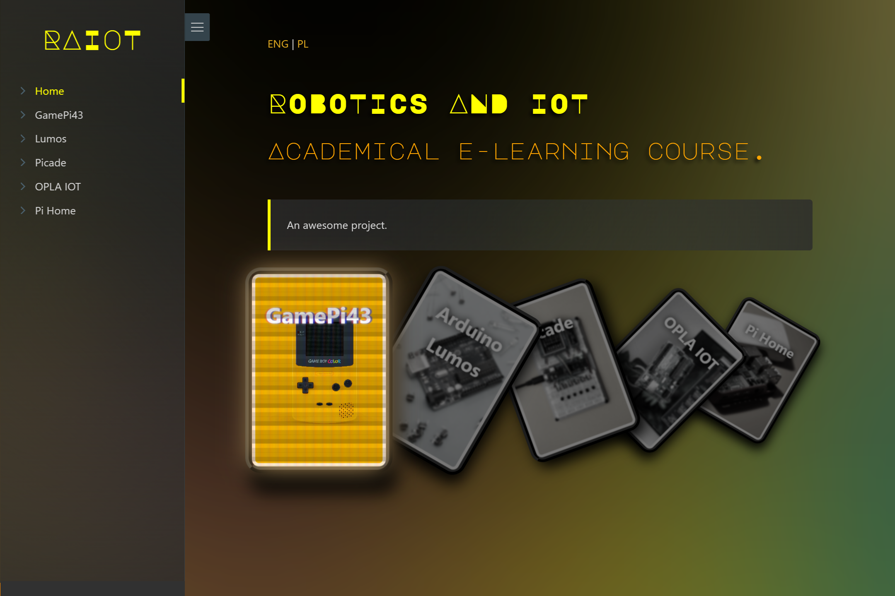

# RAIOT - Documentation Web Page :robot: :wrench: :house_with_garden:

Welcome to academical project focusing on Robotics and Internet of Things. This project aims to be a comprehensive guide covering various topics such as GamePi43, Picade, Raspberry Pi Smart Home, and much more.

I've used `Docsify` and `HTML/CSS` to build this interactive and easy-to-navigate documentation website.

## Quick Links :link:

- **See the Live Documentation Website [here](https://34panda.github.io/docsify)**
  
  

## Featured Topics :books:

- **GamePi43**: Dive into the world of portable gaming with Raspberry Pi.
  
- **Picade**: The arcade cabinet for Raspberry Pi that you can build yourself.
  
- **Raspberry Pi Smart Home**: Automate your life with a Raspberry Pi-based smart home setup.

## Contributing :handshake:

We always welcome contributions to help improve the documentation. Feel free to submit a pull request or create an issue for any corrections or enhancements.

---

> This project is part of an academical initiative to encourage learning and knowledge sharing in the field of Robotics and IoT.
