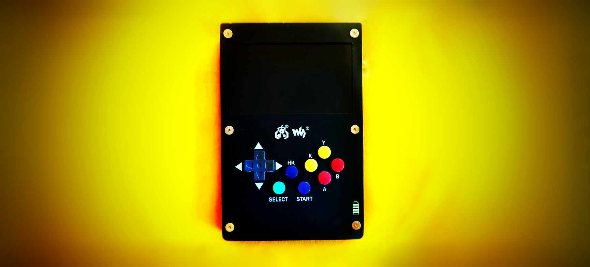
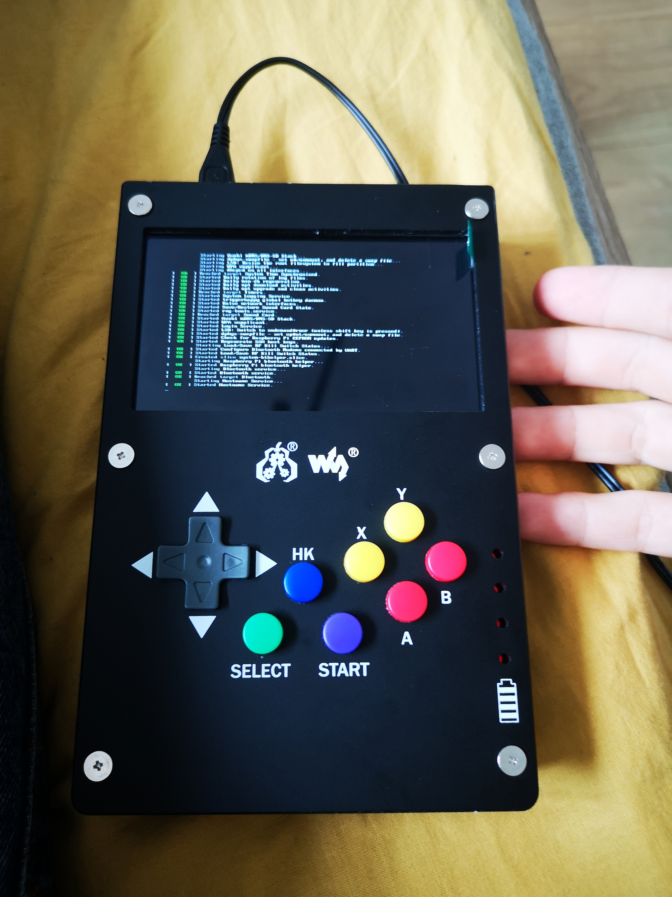

<figure class="gpi">
<link href="https://fonts.cdnfonts.com/css/major-mono-display-2" rel="stylesheet">
                
  <figcaption>GamePi43:<br><span>Raspberry pi game console</span></figcaption>
  <style>
    @import url('https://fonts.cdnfonts.com/css/major-mono-display-2');
    .gpi {
      font-family:  'Major Mono Display', sans-serif;                                   
      font-size: 35px;
      color: yellow;
    } 
    figcaption span {
      color: turquoise;
      font-size: 30px
    }
    .image-border {
      margin: 40px;
      /* border-radius: 1vmin; */
      border: 3px solid var(--primary);
      box-shadow:
        10px 10px 0 -3px var(--background),
        10px 10px var(--green),
        20px 20px 0 -3px var(--background),
        20px 20px var(--yellow);
    }
    .image-border:hover {
      animation: shadow-wave 2.5s ease-in infinite;
    }
    @keyframes shadow-wave {
      0% {
        border: 3px solid var(--primary);
        box-shadow: 10px 10px 0 -3px var(--background), 10px 10px var(--green),
          20px 20px 0 -3px var(--background), 20px 20px var(--yellow);
      }
      20% {
        border: 3px solid var(--red);
        box-shadow: 10px 10px 0 -3px var(--background), 10px 10px var(--primary),
          20px 20px 0 -3px var(--background), 20px 20px var(--green);
      }
      40% {
        border: 3px solid var(--orange);
        box-shadow: 10px 10px 0 -3px var(--background), 10px 10px var(--red),
          20px 20px 0 -3px var(--background), 20px 20px var(--primary);
      }
      60% {
        border: 3px solid var(--yellow);
        box-shadow: 10px 10px 0 -3px var(--background), 10px 10px var(--orange),
          20px 20px 0 -3px var(--background), 20px 20px var(--red);
      }
      80% {
        border: 3px solid var(--green);
        box-shadow: 10px 10px 0 -3px var(--background), 10px 10px var(--yellow),
          20px 20px 0 -3px var(--background), 20px 20px var(--orange);
      }
      100% {
        border: 3px solid var(--primary);
        box-shadow: 10px 10px 0 -3px var(--background), 10px 10px var(--green),
          20px 20px 0 -3px var(--background), 20px 20px var(--yellow);
      }
    }
    :root {
      --primary: #22D2A0;
      --secondary: #192824;
      --background: #192824;
      --green: #1FC11B;
      --yellow: #FFD913;
      --orange: #FF9C55;
      --red: #FF5555;
    }
    @media only screen and (max-width: 600px) {
      .image-border {
        margin-left: 0;
        margin-right: 50px;
      }
    }   
  </style>
</figure>

---


## Table of Contents

- [Table of Contents](#table-of-contents)
- [Introduction](#introduction)
- [Devices and Supplies](#devices-and-supplies)
- [Assembly Process](#assembly-process)
  - [Before Assembling](#before-assembling)
  - [Device Assembly](#device-assembly)
- [Operating System](#operating-system)
  - [Easy Method](#easy-method)
  - [Not So Easy Method](#not-so-easy-method)
- [ROM Games](#rom-games)
  - [Using a USB Stick or Compatible USB Memory](#using-a-usb-stick-or-compatible-usb-memory)
  - [Wirelessly with SFTP (A More Advanced Method)](#wirelessly-with-sftp-a-more-advanced-method)
- [Pico-8 Games](#pico-8-games)
- [Best Practices](#best-practices)

---



## Introduction

The GamePi43 is a retro-feel handheld gaming console that uses a Raspberry Pi as its main component.

It's fairly simple to recreate, requiring a low-to-intermediate level of technical skills for basic configuration and a high-intermediate level for customizations.

It's a great project to undertake and an amazing device to play on.

While the console's body is not ergonomic and its buttons are hard to press, it gets the job done. Although it's of lower engineering quality than consoles designed solely for gaming, its versatility and customization make it a worthwhile project.

Let's start with what we need for it to work:

## Devices and Supplies

Building the GamePi43 console is relatively straightforward. The necessary components include a compatible Raspberry Pi model (e.g., B+ / 2B / 3B / 3B+ / 4B). Remember to check compatibility with the [GamePi43](https://www.waveshare.com/wiki/GamePi43) device.

For my build, I used a [Raspberry Pi 4 8GB Kit from Botland](#) and a [GamePi43 from Botland](https://botland.com.pl/gaming-pi-retro-pie-konsole/17598-gamepi43-zestaw-akcesoriow-do-budowy-konsoli-dla-raspberry-pi-b-2b-3b-3b-4b-waveshare-16967-5904422327965.html?cd=1050025856&ad=55008030609&kd=&gclid=Cj0KCQjwuZGnBhD1ARIsACxbAVi_yP_z9whvMxNqS_-G67z5Up9icvYHbGoLaR1e1NCGWmEW12LuSBYaAiQnEALw_wcB).

**_Note:_** Only the Raspberry Pi is needed for this particular project. I used the full kit only because it was part of other projects. If your focus is solely on the GamePi43 console, purchasing just the Raspberry Pi is a cost-effective option.

The GamePi43 includes a screwdriver, but having your own, as well as a microfiber cloth to clean fingerprints off the screen, is recommended.

**_Be Aware:_** Batteries were NOT included in the kit I used. The console works with a charger connected directly to the power supply by cable. If you wish to have a wireless working console with a rechargeable battery, you need to buy accumulators and fit them into the place that is already inside the GamePi's body.

You may also need a clean USB stick, depending on your intended use for the console.

## Assembly Process

### Before Assembling

Prepare your workspace to avoid losing parts or damaging the board due to static shock or environmental variables. Arrange all components in an orderly fashion, and inspect them for any potential damage that might cause delays later.

**_Heed any warnings and precautions:_** These can be found on the product's website or packaging. Devices may vary, so adapt to different situations accordingly.

### Device Assembly

Assembly is fairly straightforward if you have inspected all the necessary pieces. Follow the instructions included with the GamePi43 or consult the manufacturer's website for a more detailed description.

I found [this visual YouTube tutorial](https://www.youtube.com/watch?v=HrKpUuo6OUg&t=173s) by MakerMan to be helpful.

During assembly, I encountered no significant issues. Inserting the HDMI adapter was slightly tricky but manageable. If you have a prepared SD card with the required system and games, insert it, plug in the power, and you're done! If not, further instructions on installing the [operating system](#operating-system) and [games](#pico-8-games) are provided below.

## Operating System

With the physical device ready, the next step is to install the operating system. Thankfully, Waveshare has a ready-made OS. Below, you'll find both the [easy method](#easy-method) and the [advanced method](#advanced-method).

### Easy Method

Use Waveshare's customized version of the RetroPie/Recalbox operating system, configured with input and additional tweaks found [here](https://www.waveshare.com/wiki/GamePi43).

Utilize an imaging application, like [Raspberry Pi Imager](https://www.raspberrypi.com/software/), to write the OS to the SD card. Insert it into the device, boot up, and configure settings such as timezone, WiFi, etc.

If everything goes smoothly, all that remains is installing your chosen games, whether [ROM games](#rom-games) or [Pico-8 games](#pico-8-games).

### Not So Easy Method

(_Instructions for the advanced method go here._)

## ROM Games

Installing ROM games is incredibly simple. Below are two simple methods.

### Using a USB Stick or Compatible USB Memory

Prepare a USB stick (8GB or more is recommended). Clean it and format to FAT32.

Create an empty directory called `retropie` on the formatted USB drive. Depending on the OS used, this name may vary; `retropie-mount` is another option.

Then update the device (skip this step if you are already on the latest OS version):

```
Main screen > RetroPie > RetroPie Setup > Basic Install
```

Enable the USB ROM Service by:

```
Main screen > RetroPie > RetroPie Setup > Configuration/tools > usbromservice - USB ROM Service > 1 Enable USB ROM Service
```

Plug your USB into the working GamePi43 device and let it run. This step is tricky because there is no indication of the process being completed unless you have a USB with a light signaling data transfer. Let it sit for 5-15 minutes, then reboot the device and plug the USB back into your computer.

If everything went right, you should have new working directories inside the USB drive. (I myself had a little issue here because for some reason my USB was not compatible with Retropie OS, and I was stuck for some time figuring out how to fix it. Luckily, I tried using another available USB device, and it worked well that time).

Now you need to find some games - it's up to you what game you want to use; for the tutorial's sake, we need the game's ROM file, and that's all.

Find the corresponding console directory within the USB drive's directories and copy the game's file into it.

Reboot the device, and you're done! You're now ready to play games on your new awesome console!

I recommend [this YouTube tutorial](https://www.youtube.com/watch?v=P1etPYvWBZU&t=373s) made by ETA PRIME if you come by any issues.

### Wirelessly with SFTP (A More Advanced Method)

For a more advanced method to transfer games, the user can utilize SFTP (SSH File Transfer Protocol). Please refer to the [Waveshare Wiki page](https://www.waveshare.com/wiki/GamePi43) for more information on this process.

## Pico-8 Games

You can purchase the license for Pico-8 [here](https://www.lexaloffle.com/pico-8.php#getpico8). Once purchased, download the Raspberry Pi zip version and unzip it to your SD card (the same one with your operating system).

After that, add a folder named "pico-8" and inside it create a subfolder named "carts". Place any games you want in there.

After that, you'll have to manually launch the Pico-8. But you're good to go!

## Best Practices

**_1. Remember to update the system regularly._**  
**_2. Make sure you have enough space on your SD card for all the games and updates._**  
**_3. Create a backup of your SD card._**  
**_4. Check for compatibility of ROMs before installing them._**  
**_5. Monitor the device's temperature and keep it in a cool environment._**

## Conclusion

---

Whether you're a seasoned Raspberry Pi user or a complete novice, the GamePi43 offers something for everyone. With both easy and advanced setup options, as well as numerous game choices, this console promises hours of nostalgic gaming fun.

Happy gaming!
