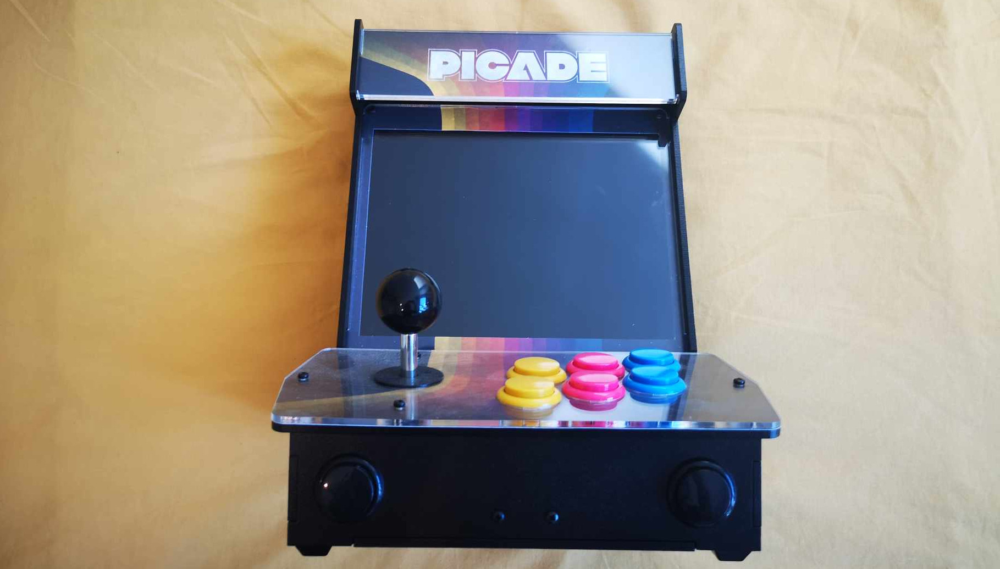
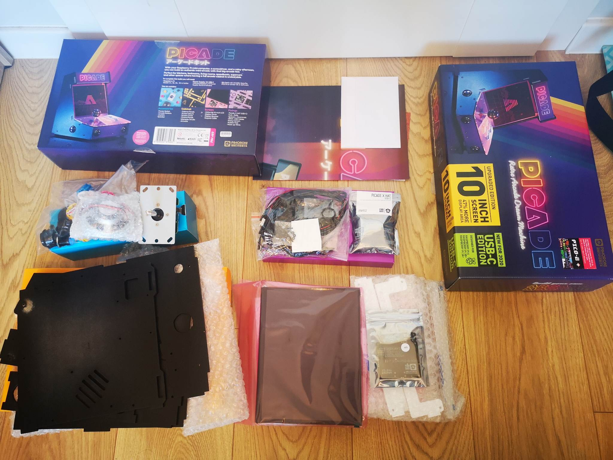
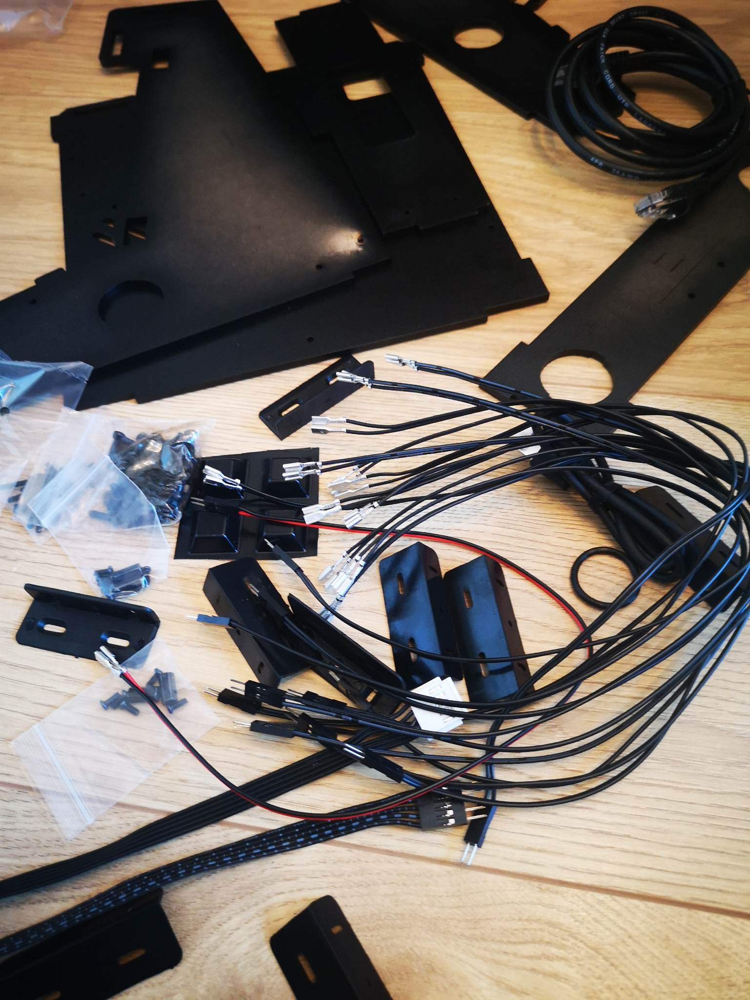
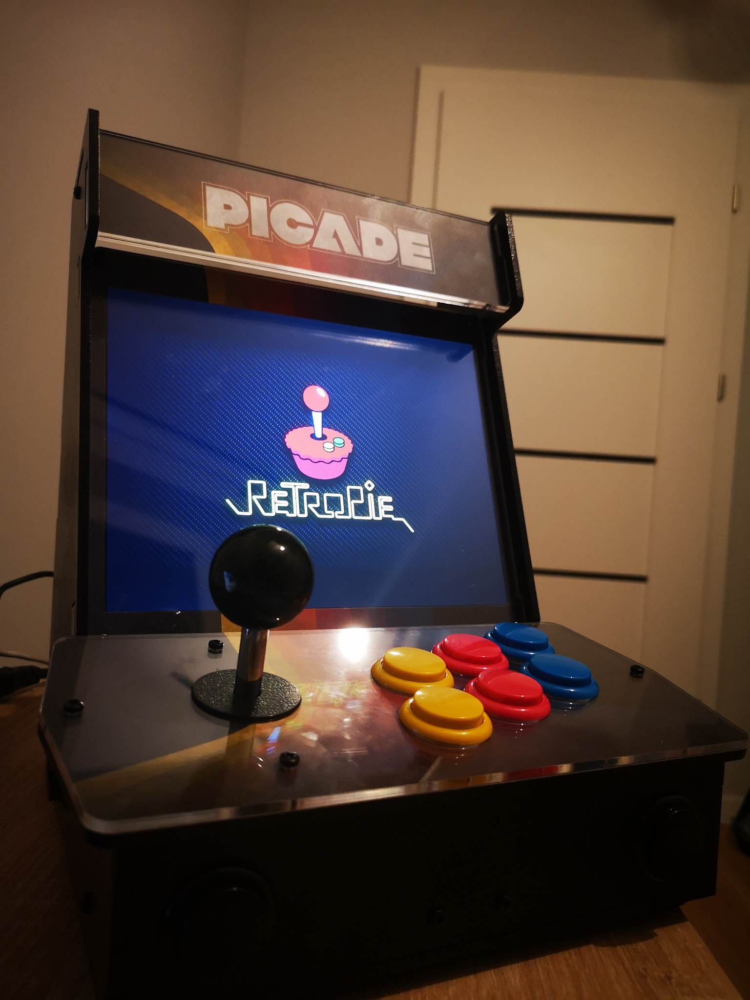
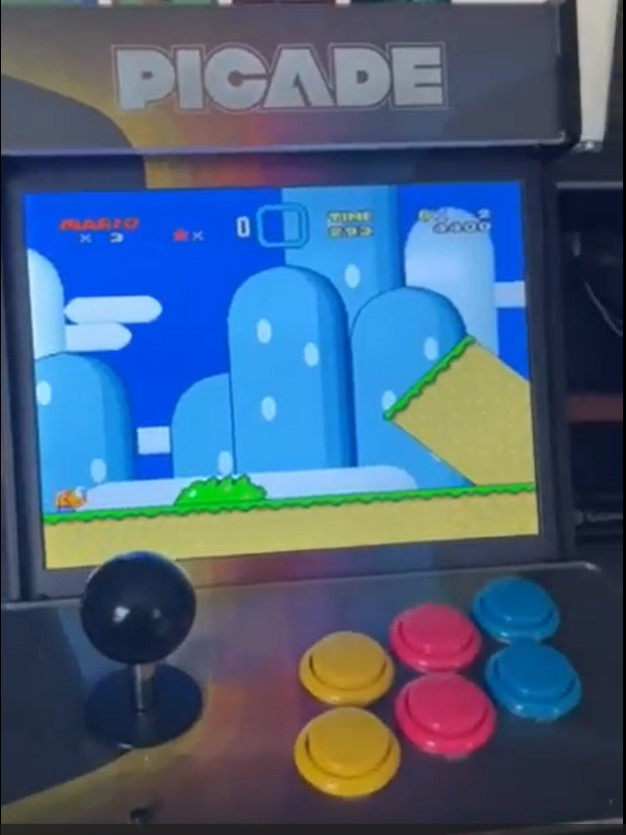
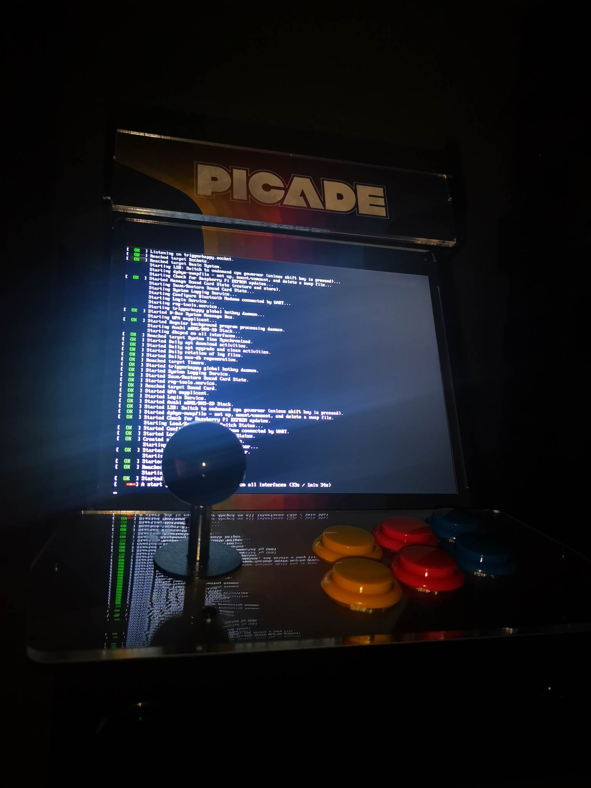
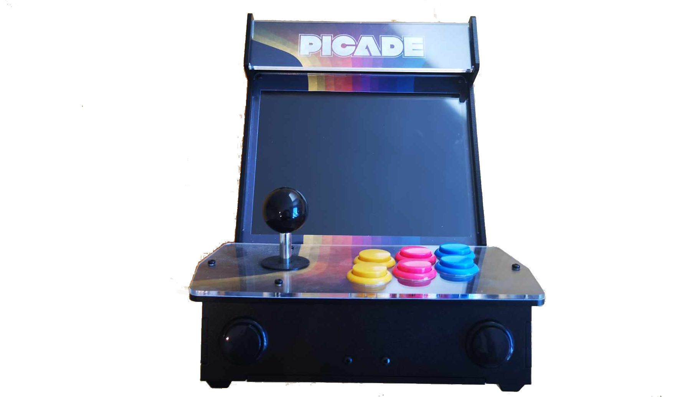

<figure class="gpi">
<link href="https://fonts.cdnfonts.com/css/major-mono-display-2" rel="stylesheet">
                
  <figcaption>PICADE:<br><span>Raspberry pi Arcade Machine</span></figcaption>
  <style>
    @import url('https://fonts.cdnfonts.com/css/major-mono-display-2');
    .gpi {
      font-family:  'Major Mono Display', sans-serif;                                   
      font-size: 35px;
      color: yellow;
    } 
    figcaption span {
      color: turquoise;
      font-size: 30px
    }
  </style>
</figure>



## Table of Contents:
- [Table of Contents:](#table-of-contents)
- [Introduction](#introduction)
- [Assembly](#assembly)
- [Operating System](#operating-system)
- [RetroPi](#retropi)
- [ROM games](#rom-games)
  - [Using a USB Stick (or other fitting drive)](#using-a-usb-stick-or-other-fitting-drive)
  - [Wirelessly with SFTP (A More Advanced Method)](#wirelessly-with-sftp-a-more-advanced-method)
  

## Introduction
"PiCade" is a kit for building a miniature arcade cabinet specially designed to work with a Raspberry Pi computer. Raspberry Pi is a small, affordable single-board computer that can be used for various purposes, including retro gaming emulation and DIY projects.

The PiCade kit includes components such as the enclosure, an LCD screen, gaming controllers (such as a joystick and buttons), a sound amplifier, and other accessories needed to assemble your own miniature arcade cabinet. Once the kit is assembled and connected to a Raspberry Pi, you can install the appropriate software and play your favorite retro games like Pac-Man, Space Invaders, or Street Fighter.

PiCade is a popular project for Raspberry Pi enthusiasts and retro gamers because it allows them to create a personalized arcade cabinet for gaming and display, serving as an interesting interior decoration element. There are various versions of the PiCade kit available, offering different sizes and features, so you can customize it to your needs and preferences.
## Assembly



Case: The PiCade kit includes a plastic case that resembles a traditional arcade machine.

Screen: The kit comes with an LCD screen.

Controls: PiCade features gaming controllers such as a joystick and buttons that allow users to play arcade games.

GPIO Hat: The kit also includes a GPIO hat that connects to the Raspberry Pi and enables the use of the joystick and buttons.

Cables and Accessories: The PiCade kit also contains necessary cables and accessories for connecting to the Raspberry Pi.

?>**_Note:_**  
It's worth noting that the availability and specific contents of the PiCade kit may vary depending on the model and version of the product, so it's always a good idea to check the manufacturer's official website or store for more information on the particular version of the PiCade kit.



The manufacturer provides step-by-step instructions on how to assemble the Picade. You can check it out on [YouTube](https://www.youtube.com/watch?v=gTgu1fUVsmw)

?>**_Note:_**  
Prepare yourself a lot of time, because it took us about 4 hours to assemble the entire set, not counting the time spent on the software.


## Operating System
Raspbian, currently known as "Raspberry Pi OS" (Operating System), is an operating system designed specifically for Raspberry Pi computers. It is a customized version of the Linux operating system based on the popular Debian system. Here are some key features of Raspberry Pi OS:

1. Free and open-source: Raspberry Pi OS is freely available and open-source software, meaning it is accessible to the programming community for modification and customization.

2. Tailored for Raspberry Pi: It is optimized for performance and the specifications of Raspberry Pi computers, ensuring smooth operation on these low-power single-board computers.

3. Support for various Raspberry Pi models: Raspberry Pi OS is adapted to work on multiple Raspberry Pi models, from older versions to the latest releases.

4. Graphical environment: Raspberry Pi OS provides a user-friendly graphical interface based on the LXDE or LXQt desktop environment. Users can access a desktop, web browser, and office applications.

5. Programming support: The system supports various programming languages, including Python, Scratch, and many others, making it an ideal tool for learning programming.

6. Application support: Raspberry Pi OS allows the installation and execution of various applications available in the system repositories. Users can also install Linux-compatible software.

7. Multitasking: The operating system enables running multiple applications simultaneously and handling various tasks.

8. Support for DIY projects: Raspberry Pi OS is a popular choice for individuals working on DIY projects such as PiCade, home automation, and media servers.

Raspberry Pi OS is tailored to meet the needs of the Raspberry Pi community and is continuously developed to provide users with better tools and features.

## RetroPi


In this project we use RetroPie which is a specially prepared operating system based on Raspbian/Raspberry Pi OS, designed for emulating older consoles and arcade machines. It is a popular solution that allows you to transform a Raspberry Pi computer into a powerful platform for retro gaming. Here are some features of RetroPie:

1. Emulation of various consoles and arcade machines: RetroPie supports a wide range of emulators that enable the emulation of games from many older consoles and arcade machines, such as NES, SNES, Sega Genesis, PlayStation, MAME (Multiple Arcade Machine Emulator), and many more.

2. Easy setup: RetroPie is designed for straightforward setup. After installing the system on your Raspberry Pi, you can easily add your games and run them using an intuitive interface.

3. Controller support: RetroPie accommodates various types of controllers, including USB controllers, gamepads, and more, allowing you to customize your gaming setup to your preferences.

4. User interface: The system includes several available user interfaces that enable customization of the platform's appearance and functionality.

5. Support for keyboard shortcuts: RetroPie offers various keyboard shortcuts that make using emulators and accessing settings easier.

6. Additional features: Besides game emulation, RetroPie allows for multimedia playback, web browsing, and many other features available in the Raspberry Pi OS.

7. Community and support: RetroPie has a large user community, meaning you can find plenty of information, tutorials, and support online from other retro gaming enthusiasts.

## ROM games

Installing ROM games is incredibly simple. Below are two basic methods.



### Using a USB Stick (or other fitting drive)

1. Prepare a USB drive with a capacity of at least 8GB and ensure it's formatted as FAT32.

2. Create an empty folder named 'retropie' on the USB drive. Note that the folder name might differ depending on your operating system; 'retropie' worked in my case, but you can also try 'retropie-mount' or explore other options if needed.

3. If your operating system is not already up to date, update it by following these steps:

- Go to the main screen.
- Select 'RetroPie.'
- Choose 'RetroPie Setup.'
- Select 'Basic Install.'
4. To enable the USB ROM Service, do the following:

- Go to the main screen.
- Select 'RetroPie.'
- Choose 'RetroPie Setup.'
- Navigate to 'Configuration/tools.'
- Select 'usbromservice - USB ROM Service.'
- Choose '1 Enable USB ROM Service.'

Now, insert the USB drive into your functioning GamePi43 device and allow it to run. This step can be a bit tricky since there is no clear indication of the completion of the process, especially if your USB drive doesn't have a data transfer indicator. Let it sit for 5-15 minutes, then reboot your device and reconnect the USB drive to your computer.

If everything went smoothly, you should find new functional directories on the USB drive. I encountered a minor issue here because, for some reason, my USB drive wasn't compatible with Retropie OS. I spent some time troubleshooting, but fortunately, switching to a different USB drive resolved the problem.

Now, you'll need to locate some games. The choice of games is entirely up to you. For the purpose of this tutorial, all you need is the ROM file of the game.

Locate the relevant console directory within the USB drive's directories and copy the game file into it.


?>**_Success:_**  
Finally, reboot your device, and you're good to go! You're now ready to enjoy games on your new and exciting console!



### Wirelessly with SFTP (A More Advanced Method)

For a more advanced method to transfer games, the user can utilize SFTP (SSH File Transfer Protocol).

Firstly - Enable SSH on GamePi34:
```raspi-config > Interface Options > SSH > Yes > OK > Finish```

Find devices IP address:
```RetroPie > Show IP```

Using SFTP client (e.g. FileZilla) on your device with ROM game files, connect to GamePi using it's IP and login info.

In most cases it's basic config:
```
Port: 22
```
```
Username: pi
```
```
Password: raspberry
```
When connected browse folders until you see ROM folder and transfer ROM games into according consoles.

!>**_Be Aware:_**   
It matters where you insert the game, it will work properly only when you insert it into dedicated console directory.

[In depth SSH tutorial by retropie devs.](https://retropie.org.uk/docs/SSH/)


