<figure class="gpi">
<link href="https://fonts.cdnfonts.com/css/major-mono-display-2" rel="stylesheet">
                
  <figcaption>PI hOME: smart Rpi home Assistance</figcaption>
  
</figure>

---

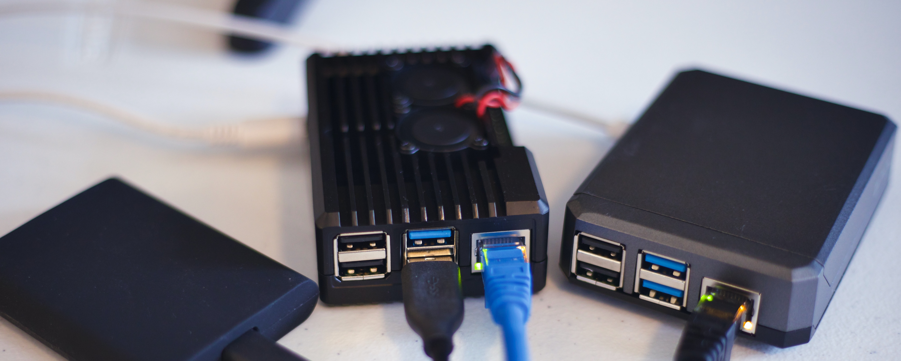

## Table of Contents
- [Introduction](#introduction)
- [Assemble Raspberry Pi](#assemble-raspberry-pi)
  - 🔌 [Raspberry Pi Installation](#raspberry-pi-installation)
  - 📦 [Case Assembly](#case-assembly)
  - 🧑‍🔧 [Cable Connections](#cable-connections)
  - ⚡ [Power On](#power-on)
  - 📥 [Download Raspberry Pi Imager](#download-raspberry-pi-imager)
- [Install Home Assistant](#install-home-assistant)
  - 🚀 [Open Raspberry Pi Imager](#open-raspberry-pi-imager)
  - 🖥️ [Select Operating System](#select-operating-system)
  - 💾 [Choose Storage](#choose-storage)
  - 📝 [Write the Installer](#write-the-installer)
  - 🗃️ [Eject the SD Card](#eject-the-sd-card)
  - 🔌 [Start Up Your Raspberry Pi](#start-up-your-raspberry-pi)
  - 🌐 [Access Home Assistant](#access-home-assistant)
- [Set up Tuya integration](#set-up-tuya-integration)
  - 📋 [Prerequisites](#prerequisites)
  - 📂 [Creating a Project](#creating-a-project)
  - 🔗 [Linking Devices](#linking-devices)
  - 🔑 [Getting the Authorization Key](#getting-the-authorization-key)
  - ⚙️ [Integration Setup](#integration-setup)
- [Implement VPN with Tailscale](#implement-vpn-with-tailscale)
  - 📥 [Download Tailscale on Your Device](#download-tailscale-on-your-device)
  - 🌐 [Integrating Tailscale](#integrating-tailscale)
  - 🔑 [Obtain the API Key](#obtain-the-api-key)
  - 🌐 [Know Your Tailnet Name](#know-your-tailnet-name)
  - 🏠 [Home Assistant Integration](#home-assistant-integration)
- [Automate LED actions](#automate-led-actions)
  - 🎆 [Visualize Smart Home Automations](#visualize-smart-home-automations)
  - 📅 [Plan Your Automations](#plan-your-automations)
  - 🔧 [Access Home Assistant Automation](#access-home-assistant-automation)
  - 🌄 [Automate LED Turn On (After Sunset)](#automate-led-turn-on-after-sunset)
  - 🌙 [Automate LED Turn Off (At 1 AM)](#automate-led-turn-off-at-1-am)
  - ⏰ [Handle Lights When Away](#handle-lights-when-away)

---

## Introduction
This project showcases the prowess of Raspberry Pi 4 and Home Assistant, offering a glimpse into the realm of smart homes. This project serves as both a practical example of Raspberry Pi usage and an introduction to simple automations that can be built using Home Assistant.

Raspberry Pi 4, the heart of your project, is a pocket-sized computer with unlimited potential. Paired with Home Assistant, an open-source home automation platform, you're set to turn your home into a smart haven with ease.

By integrating the Tuya Smart app, you can effortlessly control your Wi-Fi-connected LED lights. Imagine setting the stage for a cozy movie night with just a tap on your phone. But wait, there's more.

Home Assistant introduces you to the world of automation. In this project, we'll set up a simple automation where your LED lights gracefully come to life as the sun sets. It's the perfect way to create an inviting ambiance without lifting a finger.

Remember, this project is just the tip of the iceberg. Home Assistant opens the door to intricate automations involving motion sensors, light intensity, Zigbee devices, and more, allowing you to create complex scenarios that respond to your environment. Raspberry Pi 4, Home Assistant, and the world of smart home devices are waiting for you to explore and experiment.
## Assemble Raspberry Pi
The **justPi Kit featuring Raspberry Pi 4B WiFi 8GB RAM** is a comprehensive package that brings together essential components for an exceptional computing experience. Here's what the kit comprises and how to set it up:
- **Raspberry Pi 4B WiFi 8GB RAM:** This latest iteration of the popular minicomputer features a 64-bit 1.5 GHz processor, a whopping 8GB of RAM, and built-in Dual Band WiFi and Bluetooth 5.0 for seamless connectivity.
- **Original Raspberry Pi Power Supply:** The justPi power supply comes with a USB Type-C plug, providing a stable 5.1V output with a current capacity of 3A to keep your Raspberry Pi running smoothly.
- **Aluminum Raspberry Pi Case:** The sleek black justPi aluminum case serves a dual purpose as both a protective enclosure and a cooling solution. Equipped with two fans, it effectively dissipates heat while acting as a radiator. The kit includes thermal pads for efficient thermal transfer.
- **MicroHDMI Cable for Raspberry Pi:** A 1.5m microHDMI to HDMI cable is included to establish a reliable connection between your Raspberry Pi and a monito
- **32GB microSD Card:** The included microSD card provides ample storage space for your operating system, applications, and data.
- **Ethernet Cable:** A UTP 5e Ethernet patch cord, over 2m in length, enables you to establish an Internet connection. It's sent in a randomly selected color.

#### Setting up:
1. **Raspberry Pi Installation:**

Carefully insert the 32GB microSD card into the Raspberry Pi's microSD card slot.

2. **Case Assembly:**

Place the Raspberry Pi into the aluminum case, ensuring the ports align properly. Secure the case using the included screws.

3. **Cable Connections:**

Connect your Raspberry Pi to peripherals using the included microHDMI cable, power supply, and Ethernet cable.

4. **Power On:**

Power up your Raspberry Pi using the provided power supply. The dual fans will start automatically, ensuring optimal cooling.

5. **Download the latest version of Raspberry Pi Imager and install it.**

If you want to use Raspberry Pi Imager from a second Raspberry Pi, you can install it from a terminal using sudo apt install rpi-imager.

>**Note**  
>If you need more help, you can use [Rasperry pi documentation](https://www.raspberrypi.com/documentation/computers/getting-started.html).

## Install Home Assistant
### Open Raspberry Pi Imager:

Launch the Raspberry Pi Imager software.

### Select Operating System:

Click on "Choose OS."
Navigate to "Other specific-purpose OS > Home assistants and home automation > Home Assistant."
Choose the correct Home Assistant OS version for your Raspberry Pi hardware (RPi 3 or RPi 4).
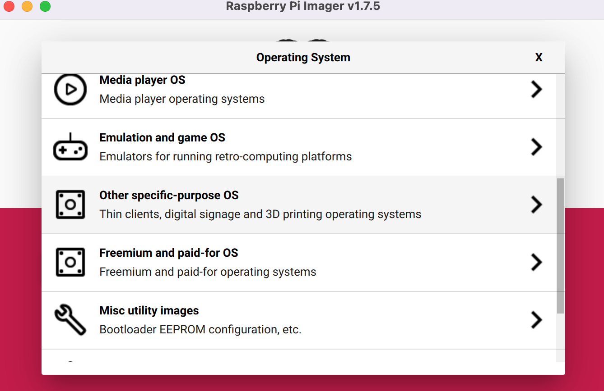

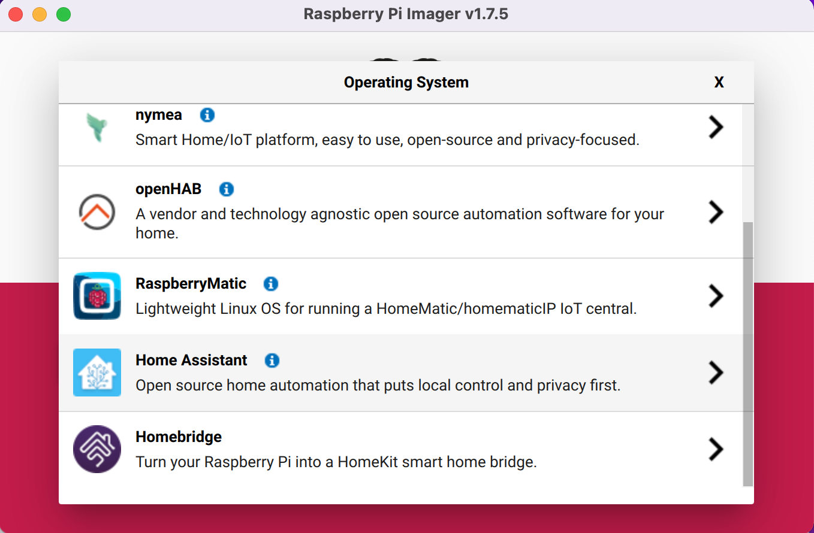

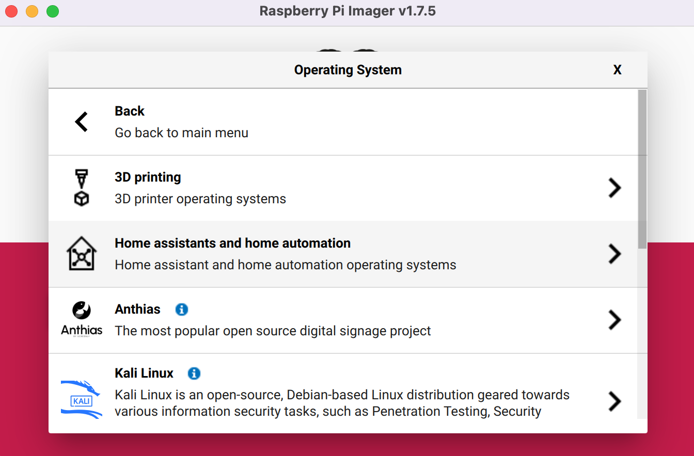

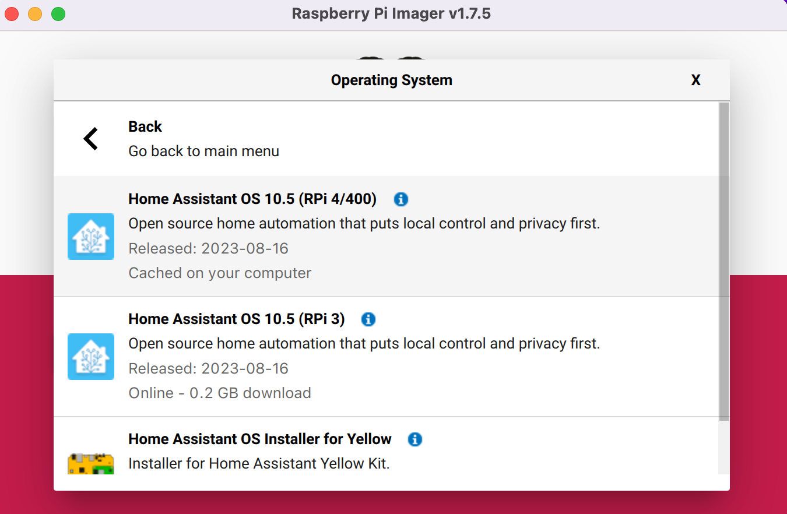
### Choose Storage:

Insert your microSD card into your computer. Remember that all card content will be overwritten.
Select your microSD card from the list.

### Write the Installer:

Click on "Write" to begin writing the Home Assistant OS onto the microSD card.
Wait until the process is complete.

### Eject the SD Card:

Safely eject the microSD card from your computer.

### Start Up Your Raspberry Pi:

Insert the microSD card into your Raspberry Pi.
Connect an Ethernet cable to your Raspberry Pi, and ensure the other end is connected to your network.
Plug in the power supply to turn on your Raspberry Pi.

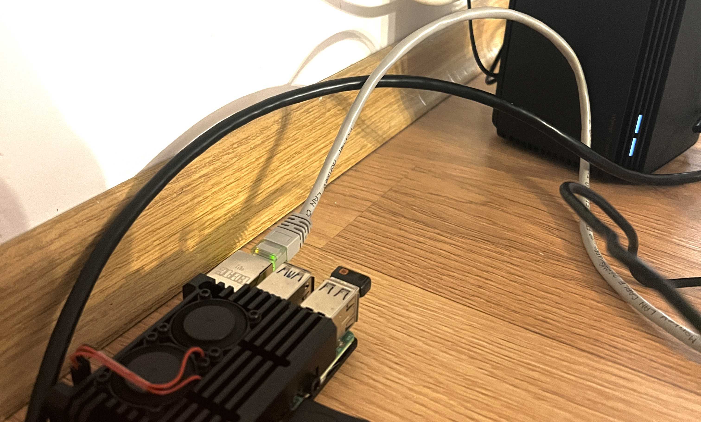

### Access Home Assistant:

On your desktop browser, within a few minutes, you can access your new Home Assistant at homeassistant.local:8123.
If you face difficulties due to an older Windows version or network setup, you might access Home Assistant at homeassistant:8123 or http://X.X.X.X:8123 (replace X.X.X.X with your Raspberry Pi’s IP address).

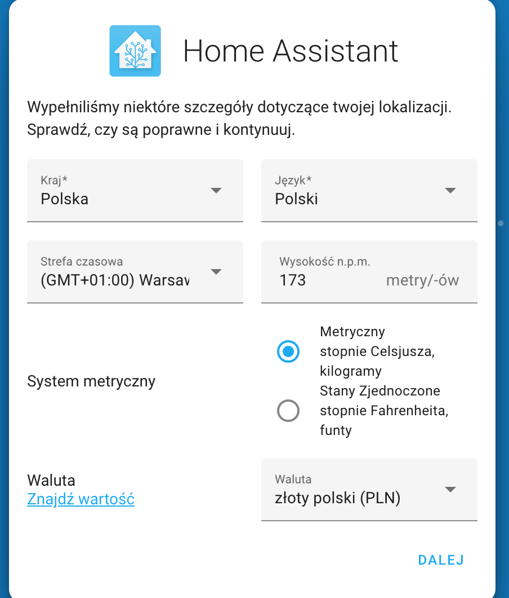

>**Note**  
>If you need more help, you can use [Installation Home Assistant](https://www.home-assistant.io/installation/raspberrypi).
## Set up Tuya integration
### Prerequisites:
- **Download Tuya Smart App:**
Before you begin, download and install the Tuya Smart app on your device.

- **Add LED Lights in Tuya Smart App:**
Using the Tuya Smart app, add the LED lights that connect to your WiFi network. Follow the app's instructions to complete the setup.

- **Create Account in Tuya IoT Platform:**
To proceed, you need an account on the Tuya IoT Platform. Please note, this account is separate from your Tuya Smart app account. Create a new account on the Tuya IoT Platform by following their registration process. Keep this account information handy for further steps.

By ensuring you have the Tuya Smart app installed, your LED lights connected via WiFi, and a Tuya IoT Platform account created, you'll be ready to proceed with the Tuya IoT Platform configuration for integration with Home Assistant.
### Creating a Project:

1. Log in to the Tuya IoT Platform.
1. Click on Cloud > Development in the left navigation bar.
1. On the page that appears, hit Create Cloud Project.

1. Fill in Project Name, Description, Industry, Data Center, and choose Smart Home as the Development Method. Select your 1. location's Data Center.
1. Click Create to proceed.
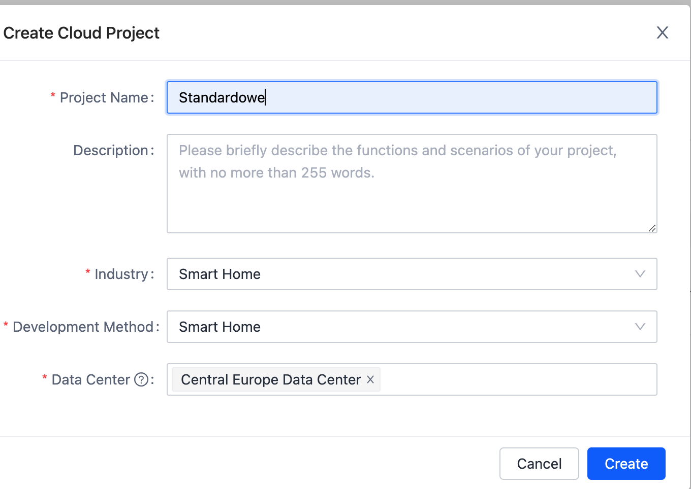
1. In the Configuration Wizard, add Industry Basic Service, Smart Home Basic Service, and Device Status Notification APIs.
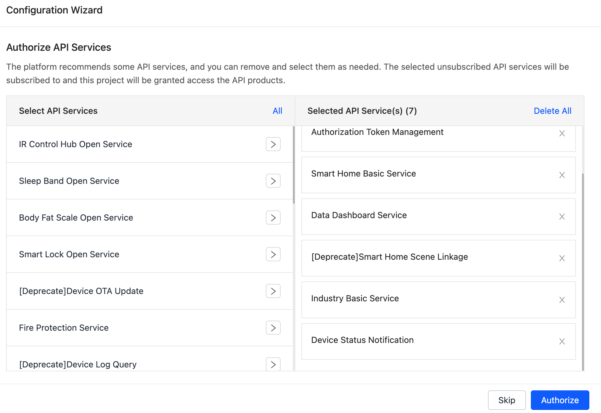
1. Click Authorize.
### Linking Devices:
1. Go to the Devices tab.
1. Click Link Tuya App Account > Add App Account.
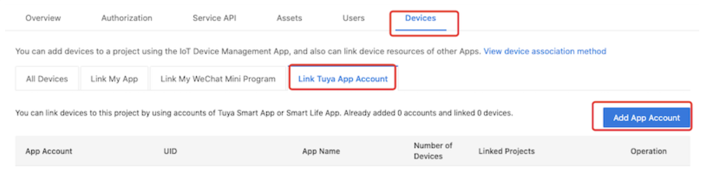
1. Scan the QR code using the Tuya Smart app or Smart Life app under the 'Me' section.
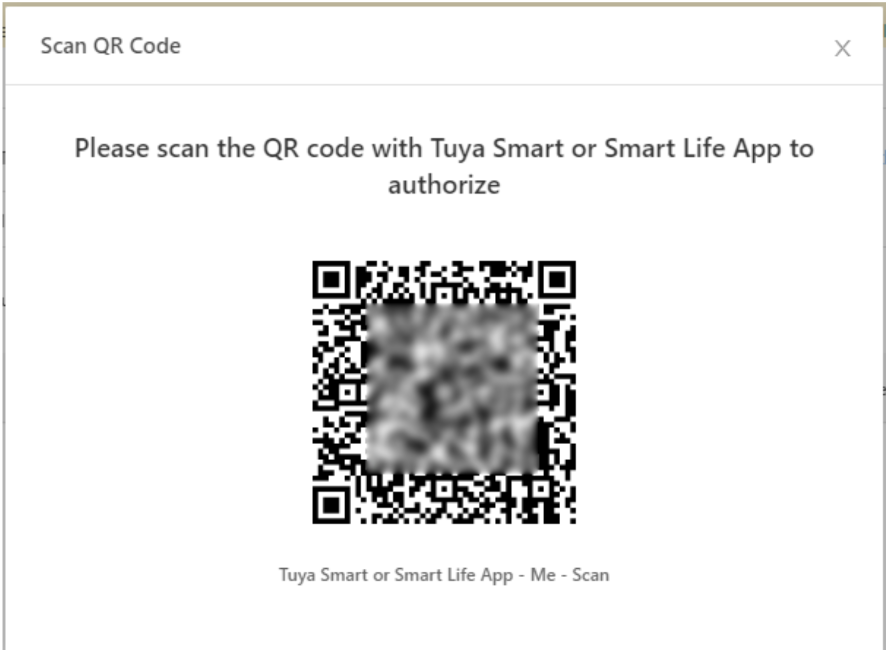
1. Confirm in the app.
1. Check that your LEDs are listed.
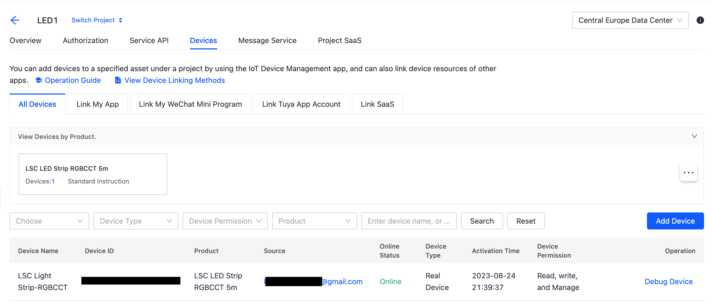
### Getting the Authorization Key:
Click the project to enter the Project Overview page and find the Authorization Key. You'll need this for integration setup.
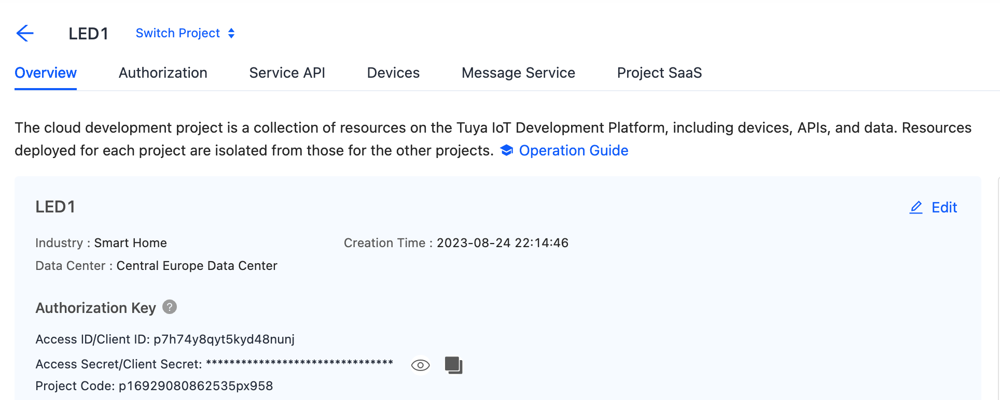
### Integration Setup:
1. Go to your Home Assistant instance.
1. Open Settings > Devices & Services.
1. Click the Add Integration button at the bottom right.
1. Choose Tuya from the list.
1. Follow on-screen instructions to complete the setup.
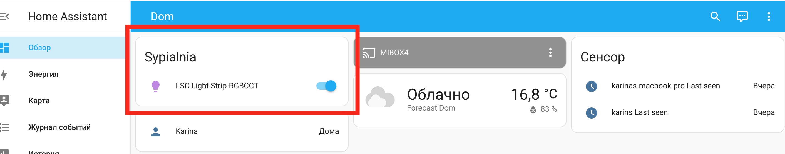

>**Note**  
>If you need more help, you can use [Integration of Tuya](https://www.home-assistant.io/integrations/tuya/#configuration-of-the-tuya-iot-platform).
## Implement VPN with Tailscale
For our project's purpose, it's crucial that your device's movements, specifically when you leave home, are tracked and transmitted effectively. To achieve this, your device's data should remain within the common network, which is where Tailscale comes into play.

By ensuring that the Tuya Smart app is at your fingertips, your LED lights are set up, your Tuya IoT Platform account is ready, and you understand the importance of data transmission within a shared network, you're primed to move forward with configuring Tailscale integration for Home Assistant. This will provide the groundwork for monitoring and automating device states within your Tailscale VPN network, adding an exciting layer of functionality to your project.
### Download Tailscale on Your Device
To begin, let's ensure we have Tailscale on your device. Head to your device's app store, search for Tailscale, and install it. This app is your gateway to effortless remote device monitoring.

### Integrating Tailscale
Now, let's seamlessly integrate Tailscale with your device. Once Tailscale is installed, follow the setup process. This bridges your device to the Tailscale network, opening the door to remote access and management.

### Obtain the API Key
For added empowerment, let's secure an API key. You can create one in the [Tailscale Admin Panel](https://login.tailscale.com/admin/settings/authkeys).This digital key unlocks a world of possibilities. The API key allows communication between Tailscale and other platforms, like our beloved Home Assistant. Creating one is a breeze. Access the Tailscale Admin Panel, generate an API key, and give your integration superpowers.

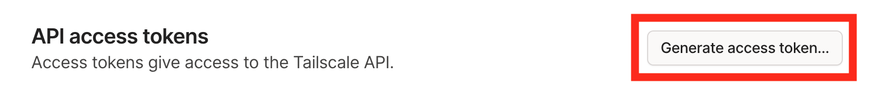

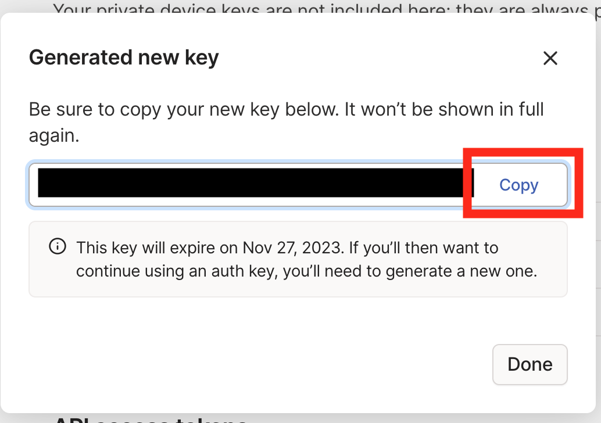

### Know Your Tailnet Name
Devices love to converse within a "Tailnet" - their exclusive realm. Familiarize yourself with your Tailnet's name. Where to find it? Simply gaze at the top left corner of the Tailscale Admin Panel, right beside the Tailscale logo. This little gem is the key to harmonious device communication.

### Home Assistant Integration
Now, let's bridge this with Home Assistant, the conductor of automation symphonies. Within Home Assistant's interface, add the Tailscale integration. You might discover it automatically, labeled as "Discovered." If not, don't worry; manually add it.
1. Go to your Home Assistant instance.
1. Open Settings > Devices & Services.
1. Click the Add Integration button at the bottom right.
1. Choose Tailscale from the list.
1. Follow the prompts to complete this union.
## Automate LED actions
### Visualize Smart Home Automations:
Imagine your home adapting to your presence automatically. Lights welcoming you back, the thermostat adjusting to your comfort—it's all within reach.

### Plan Your Automations:
Think about the scenarios you want to create. For example, lights turning off and temperature settings changing when you leave home.

### Access Home Assistant Automation:
Inside Home Assistant, navigate to the "Configuration" tab, then select "Automations."

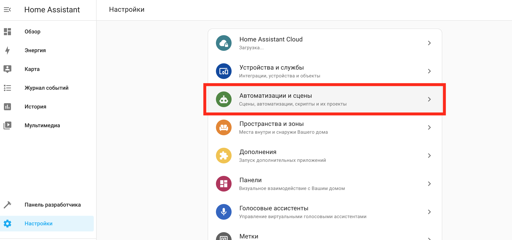

### Automate LED Turn On (After Sunset):
1. Create a new automation.
1. Define the trigger as "Time" and set it to "After sunset."
1. Add a condition: "Device Tracker" is home.
1. Set the action to turn on the LED lights.

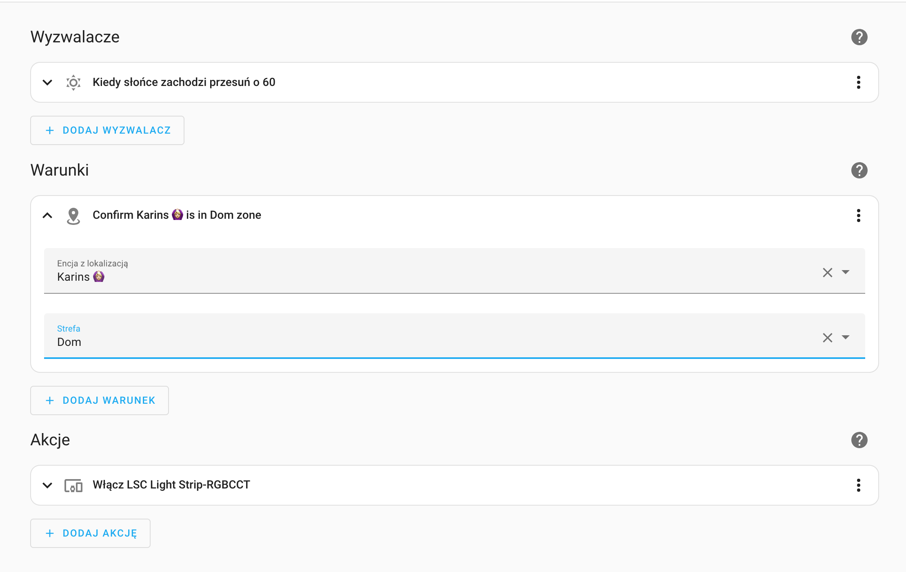

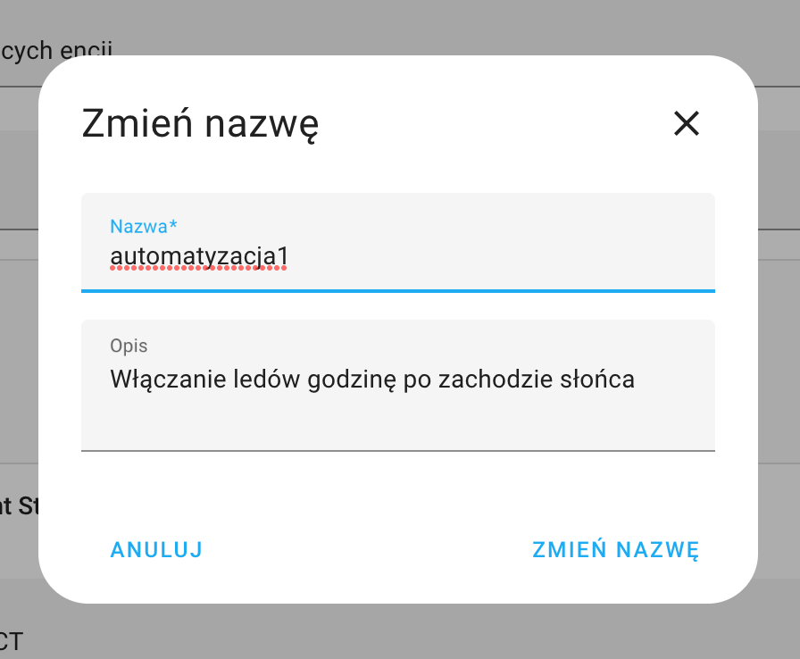

### Automate LED Turn Off (At 1 AM):
1. Create another automation.
1. Define the trigger as "Time" and set it to "1:00 AM."
1. Add a condition: "Device Tracker" is home.
1. Set the action to turn off the LED lights.

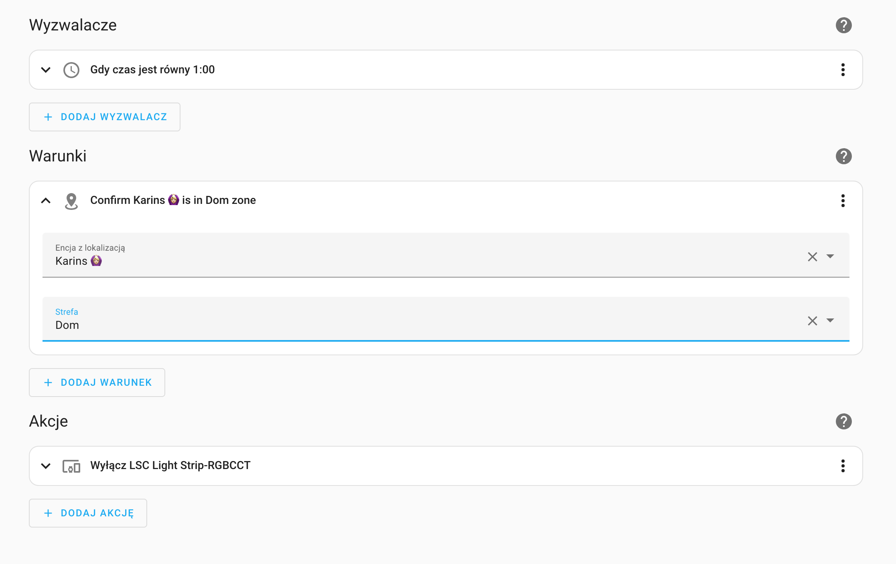

### Handle Lights When Away:
1. Create a third automation.
1. Add a condition: "Device Tracker" is not home and "LEDs are on."
1. Set the action to turn off the LED lights.

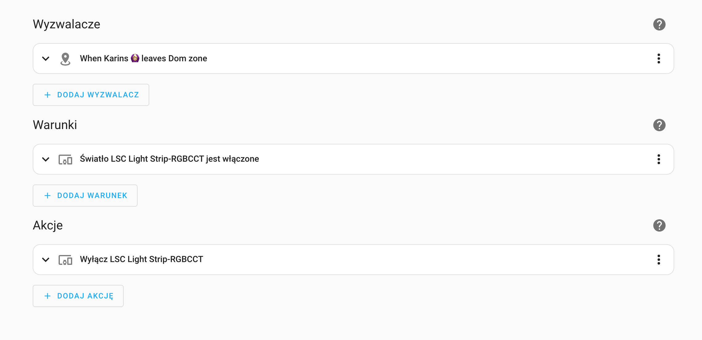

By integrating these automations with geolocation, your smart home orchestrates a symphony of actions based on your location and time. As you leave, lights turn off; as night falls, they turn on. These automations ensure your LED lights align with your lifestyle seamlessly. With each departure and arrival, your smart home dances in harmony with your routines.

## Summary
In the enchanting journey of crafting your very own smart sanctuary, you've embarked on a wondrous adventure. Let's bask in the glow of what you've accomplished:

With the brilliant Raspberry Pi 4B at the helm, you've constructed the foundation for your smart home aspirations. The 8GB RAM, WiFi, and Bluetooth capabilities serve as your digital command center.

Intricately assembling the Raspberry Pi components and securing it within the sleek aluminum housing, you've not only optimized performance but also harnessed efficient cooling through the dual-fan wonder.

The orchestration of Home Assistant, your true maestro, brings your devices under a single harmonious command. Merging seamlessly with the Tuya IoT Platform, your LED lights are now your responsive companions, influenced by sunset and your presence.

Through the magic of Tailscale, your digital boundaries extend beyond walls, allowing remote management of your smart haven. Geolocation becomes your ally, automating lighting scenarios as you step into your world.

Your realm is now illuminated by Home Assistant's automations, choreographed with artistry. As night embraces the sky, lights awaken; as dawn approaches, they gracefully bow.

In departure, your home fades into tranquility, with LED lights following suit at the stroke of 1 AM. Not a beat is missed. And as you venture forth, your dwelling takes a sigh of rest, ensuring no energy is wasted in your absence.

Congratulations on your creation—a symphony of technology and ingenuity. Your smart oasis hums with life, attuned to your presence, and responsive to your desires. Your realm is now a tapestry woven with threads of automation, leaving you to simply savor the luxury of living in the future.

In your hands lies not just a project, but a vision realized. The world of smart living bows to your ingenuity, and your sanctuary stands as a testament to the marvels you've woven.

